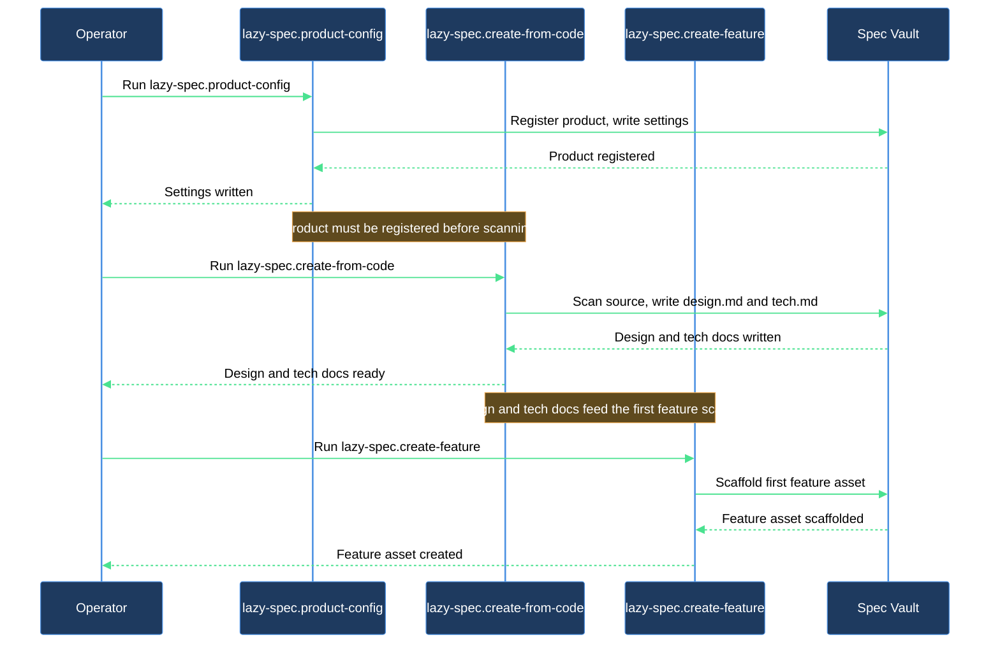

# How do I get specs for a codebase that already exists?

You have a working codebase — a service, a library, an application — and no spec to go with it. This walkthrough starts from the vault spec that has to exist before any product can be registered, then takes you through registering the product in the spec system, generating a behavior-and-source-grounded specification directly from the code, and scaffolding the first feature so the asset lifecycle can begin. Three skills carry the bulk of the work; your job is to answer their wizard questions and review what lands.

## Outcome

After completing this walkthrough you will have:

- A project-wide vault spec (`vision.md` at the spec content root — or, for a vault seeded before the vision-document kind existed, a pre-vision `design.md`) confirmed present — either an existing one or a freshly seeded draft.
- A product record in `lazy.settings.json[products]` that names your codebase's source repo and the paths within it your product covers.
- A product `vision.md` — goals, requirements, and value proposition, authored first from the code survey.
- A `design.md` — behavior-only, no source URLs, opening with a reference to the sibling vision doc — describing what the product does for its users.
- A `tech.md` — code-grounded, with forge-correct source URLs — covering the source map, architecture, and components.
- Optionally a product-level `use-cases.md` — actors and cross-feature scenarios — if you opted in when `lazy-spec.create-from-code` asked.
- At least one feature folder under `features/<slug>/` with a scaffolded `design.md` ready for authoring (`code-plan.md` / `test-plan.md` are opt-in, authored later).
- Review classes wired so every doc enters the review loop automatically.

None of `vision.md`, `design.md`, or `tech.md` gets a diagram automatically — the product-scan skill draws no pictures at all. If you want one, ask for it afterward via `/lazy-diagram.draw` against a heading in any of them.

## What you need

- `lazycortex-specs` installed and running (`/lazy-spec.install` completed at least once in this repo).
- `lazycortex-core` available — it provides the `settings-get` / `settings-set` CLI and the runtime daemon.
- A local checkout of the source repo you want to document — either the same repo that holds your spec vault (`/lazy-spec.product-config` can register it with `local_path: "."`, so every checkout resolves its own root with no absolute path needed), or a separate checkout that exists on disk at a path Claude Code can read.
- At least one expert registered in `lazy.settings.json[experts]` for each review role you plan to assign — use-case-writer, designer, system-designer, architect, ui-designer, planner, developer, and tester (plus data-writer and researcher if your product needs them) — unless this is not your first product in the vault, in which case you can ride the shared expert set an earlier product already set up. If you have not set up experts yet, run `/lazy-spec.install` — it offers to configure them — or run `lazycortex-experts` to compose the personas first.
- `lazycortex-diagram` available — Step 4's feature scaffold draws a flow diagram automatically; Steps 2 and 3 draw nothing on their own, so it is only needed there if you choose to draw a diagram yourself afterward.

## The journey

### Step 1 — Confirm the vault spec exists

Before any product can be registered, the spec catalog needs a starting point: a project-wide `vision.md` at the vault's content root (`specs/vision.md` by default), stating the intent and value of the whole project — every product is a consequence of that document, not the other way around. `/lazy-spec.product-config` enforces this: in create mode it checks for `vision.md` — or, for a vault seeded before the vision-document kind existed, a pre-existing `design.md` without a vision (the legal pre-vision state; migrating it to a vision doc is the operator's own call, by hand) — and aborts with `aborted:no-vault-spec` when neither is present, before asking you a single wizard question.

`<specs-cli>` stands for the specs plugin's `bin/lazycortex-specs` file — the newest copy under `~/.claude/plugins/cache/lazycortex/lazycortex-specs/<version>/`, or `claude/lazycortex-specs/` in a checkout that authors the plugin. Every verb runs through the interpreter, `"${LAZYCORTEX_PYTHON:-python3}" <specs-cli> <verb>`: the file carries no exec bit and is not on `PATH`.

If `/lazy-spec.install` has already run in this repo, its own seeding step (Step 6.9) already created a draft `vision.md` here — either it was `already-present` (your vault already had one) or it wrote one (`seeded`), seeded by `"${LAZYCORTEX_PYTHON:-python3}" <specs-cli> seed-doc` beside the catalog root's level note with the type's icon and colour already in place, no questions asked. If you have not run `/lazy-spec.install` yet, run it now; the vault-vision seed is part of its normal setup, not a separate step you invoke by hand.

The seeded draft is deliberately minimal — presence is the whole gate `/lazy-spec.product-config` checks, not any particular level of completeness. You can flesh it out before or after registering your first product; the review loop picks it up through the standard `system-vision` class either way.

**Verification gate.** `<content-root>/vision.md` exists on disk (content root defaults to `specs/`), in any state — draft or approved. A vault that predates the vision-document kind may instead carry a pre-vision `<content-root>/design.md` with no vision — either satisfies the gate.

### Step 2 — Register the product with `/lazy-spec.product-config`

Run `/lazy-spec.product-config`. The skill opens a wizard and asks one question at a time.

The key decisions you will make:

- **Product key** — an arbitrary stable string you choose for the record under `products[<key>]` (lowercase-with-hyphens recommended, e.g. `api-gateway`). It is the product's stable identity across config and every skill invocation — it is not derived from the folder path and never changes when the folder moves.
- **Spec path** — the content-root-relative folder where this product's specs will live, any shape you like: a top-level folder, or nested under organizational folders of your own choosing. The wizard offers existing folders as suggestions plus a free-text path.
- **Language** — an optional override of the vault-wide default language for this product's generated prose.
- **Source** — whether this product has source code (it does) and which registered repo key maps to it. If the checkout is not registered yet, the wizard runs an inline sub-wizard to capture the local path and default branch for you. When the code lives in the very repo that holds your spec vault, pick `this repo (.)` — the wizard writes the literal `"."` so every checkout (dev machine, or a runtime checkout elsewhere) resolves its own root, no absolute path required. Otherwise point it at the root of a separate checkout that lives elsewhere on disk.
- **Source paths** — the subdirectories within the repo that this product covers. A single path like `src/api` is fine; you can add more paths if the product spans multiple subdirectories. The skill validates that each path exists on disk.
- **Dependencies** — the skill dispatches a read-only scan of your source paths and presents each detected dependency (internal products, cross-repo, or external packages) for you to accept or skip, one at a time.
- **Icon** — every product gets one: pick a concrete suggestion or type your own, or decline and the product still gets the default `LiPackage` — a product never ends up icon-less in the file explorer. The product root is also the only ordinary container the wizard paints a colour on (a neutral, state-independent shade); the group folders that appear under it as you add assets carry no colour of their own.
- **Guidelines** (optional) — per-role file paths whose contents are folded into an expert's job context whenever an operator later ticks a launch checkbox on this product's assets.
- **Review experts** — ten roles review this product's docs: **use-case-writer** (`use-cases.md`), **designer** (asset-level `design.md`, plus a validation pass on `use-cases.md`), **system-designer** (the product's own `vision.md` / `design.md`, and the project-wide `vision.md` / `design.md`), **architect** (the product's `tech.md` plus any `architecture.md`, and a standing validator on every design-shaped doc including `ui-design.md`), **ui-designer** (`ui-design.md`), **planner** (`code-plan.md`), **developer** (`code-report.md`), **tester** (`bug.md`, `test-plan.md`, `test-report.md`), **data-writer** (`data-report.md`, only relevant if your product produces data-report docs), and **researcher** (a research asset's `research.md`, plus a validation pass on `research-design.md`, only relevant if your product uses the research asset type). If the vault already carries a shared expert set from an earlier product, you can ride it as-is or define a product-specific override; otherwise your answers here seed the vault's shared set. A vault whose shared set predates the use-case-writer, ui-designer, or researcher roles is asked for those separately, even when it rides the shared set for everything else.
- **Asset types** — optional; declare any beyond the shipped feature/change/bug set now, or later via `/lazy-spec.add-asset-type`.
- **Workflow mode** — `full` (design through implementation and testing, the default) or `spec-only` (stops after `design.md` approves, released only by an explicit operator word). Most code-bound products want `full`.

When the wizard finishes, the skill writes the product record into settings, creates the product folder with its folder-note — now the level note the `spec.catalog-coordinator` owns, carrying `spec_role: product`, the four level gates (all starting `false`), and the coordinator's own sections (`# Summary`, `# Gates`, `# Status brief`, `# Coordinator rules`, `# Coordinator commands`, `# History`, `# Attachments`) alongside its précis and stats markers — plus the shared vault-root request inbox, and generates the built-in review classes — one per document type marked for review (use-cases, design, system-vision, system-design, system-tech, code-plan, test-plan, bug, plus the implementation and testing report docs) — reusing the vault's shared set when your expert choices match it. It then runs `/lazy-spec.audit` automatically and reports any issues.

If `/lazy-spec.product-config` points you at `lazycortex-experts` before finishing, it means a chosen expert name is not registered. Compose the persona via `lazycortex-experts`, then re-run `/lazy-spec.product-config`.

**Verification gate.** Before continuing, confirm that `lazy-spec.audit` in the report shows no failures. The product folder and its folder-note should exist on disk, carrying `spec_role: product` and its four level gates all `false` — `features/`, `changes/`, and `bugs/` do not appear yet: group folders are created lazily, the first time an asset lands in one (Step 4 is what creates `features/`).

### Step 3 — Generate the spec from code with `/lazy-spec.create-from-code`

Run `/lazy-spec.create-from-code <compound-key>` where `<compound-key>` is the product key the previous step just wrote (e.g. `backend-api-gateway`).

The skill resolves your product's source binding, then fans out four parallel Explore agents to scan the codebase:

- **Agent A** — classes, functions, routes, and their signatures.
- **Agent B** — data structures, constants, and UI or template surfaces.
- **Agent C** — known limitations, TODOs, and cross-repo imports.
- **Agent D** — candidate features: sub-folders or route groups that cohere as independently nameable units.

After scanning, the skill authors the product's docs in order.

**`vision.md`** comes first, when your product does not already have one: an overview of what the product is and who it is for, its goals, the hard requirements the solution must not violate, the value proposition, and a short design-concept paragraph pointing at the sibling design — all filled from the code survey, then marked `draft`. Risk is not a vision-level section — the vision states intent and constraints, and the design works out what to do about risk (see `design.md` below). A `vision.md` that already exists is left untouched.

**`design.md`** is behavior-only: what the product does, who uses it, and what the user-visible limitations are. It never contains source URLs or file paths — just observable behavior — and it opens with a reference to the sibling vision doc rather than restating goals and value, which live only in `vision.md`. Where the code shows a genuine fork was taken — a real alternative existed, reversal would be expensive, and the "why" is not recoverable from the code itself — the skill records it inline as a decision callout in the design body; approving the design later promotes these into the product's `decisions.md` automatically. This skill draws no diagrams — if you want a picture under `## Behavior` (or a UI subsection you add later), ask for one via `/lazy-diagram.draw` against that heading once the doc exists.

Once `design.md` is written, the skill asks one question: also author the product-level `use-cases.md` (actors and cross-feature scenarios) from the same code survey? This is opt-in — decline and the doc is simply never created, with no gap to fix later.

**`tech.md`** is code-grounded: the source map, architecture narrative, component breakdown, route tables (if applicable), and a dependency table with forge-correct source URLs. Like the other docs, no diagram is drawn automatically here either — request one via `/lazy-diagram.draw` against `## Architecture` or `## Components` if you want one.

Once every doc is written, the skill presents Agent D's candidate feature list and asks you what to do with each one:

- **scaffold feature** — delegates immediately to `lazy-spec.create-asset`, which opens its own wizard for that feature (see Step 4). Pick this for features you want to document now. Scaffolded features leave no trace in `design.md` — the folder-notes aggregate the decomposition catalog.
- **treat as architectural area** — adds a subsection to the tech doc's `## Architectural Areas`; no feature folder is created.
- **skip** — leaves no trace.

Work through each candidate. You do not need to scaffold all of them now — you can run `/lazy-spec.create-feature` again later for any candidate you skipped.

**Verification gate.** `vision.md`, `design.md`, and `tech.md` should exist and carry `spec_stage: draft` (`use-cases.md` too, if you opted in). The design doc must contain no source URLs and no `spec_source_branches` frontmatter. All the docs should carry the default `spec_source_docs` frontmatter and a body `# Sources` section pointing at each other.

### Step 4 — Scaffold the first feature with `/lazy-spec.create-feature`

If you chose "scaffold feature" for at least one candidate in Step 3, `lazy-spec.create-asset` already ran inside that step and your first feature folder is ready. You can skip directly to the verification gate below.

If you deferred all candidates or want to add a feature that was not in the candidate list, run:

```
/lazy-spec.create-feature <compound-key> <feature-slug>
```

The skill asks you a small set of clarifying questions about the feature's scope, who triggers it, and any edge-case behavior to capture. It then scaffolds `features/<feature-slug>/` with:

- A status folder-note (`<feature-slug>.md`) carrying the feature icon, a `# Summary` précis, and an empty gate record.
- `design.md` — authored from your answers, behavior-only, with a `flow` diagram drawn under the behavior section — the only doc the scaffold seeds.

`code-plan.md` and `test-plan.md` are opt-in — your planning and testing workflow authors them later, whenever there is dev or test work to plan; the scaffold never creates them.

**Verification gate.** The feature folder `features/<feature-slug>/` should contain the folder-note and `design.md` (stage `draft`). Open `design.md` and confirm the flow diagram is rendered. No `tech.md`, no `layout` doc, and no `code-plan.md` / `test-plan.md` should be present yet — those either don't exist at the asset level or are opt-in and not yet authored.

## After you're done

The product is registered and its initial spec is live. From here:

- **Add more features** — run `/lazy-spec.create-feature <compound-key> <slug>` for each new feature you want to document. You can scaffold any of the candidates Agent D surfaced, or invent a new slug for a feature the scan did not detect.
- **Keep docs in sync with code** — when source changes land, run `/lazy-spec.sync-with-code <compound-key>` to surface behavior changes for the design doc, update branch pins if you are working on a non-default branch, and propose gate/stage corrections (e.g. flipping `spec_develop_done`) grounded in what actually shipped — always with your confirmation before anything is written.
- **Drive assets through their gates** — use `/lazy-spec.flip-gate` to advance a feature's readiness gates (`spec_design_done` → `spec_plan_done` → …), or let `spec.coordinator` advance derived gates for you on its next wake (the `lazy-spec.gate-tick` routine itself only polls jobs and checks note structure).
- **Re-run the doc scan** — if the codebase grows significantly, re-run `/lazy-spec.create-from-code <compound-key>` to refresh the design and tech docs. The skill reconciles existing branch pins before overwriting, and leaves an already-present `vision.md` untouched.
- **Audit checks** — run `/lazy-spec.audit <compound-key>` at any time to audit the product tree for broken links, missing sections, role violations, and source-link staleness. It is read-only and only reports: each finding names the verb, skill, or hand edit that clears it.

## How the skills hand off


```mermaid
%%{init: {'themeVariables':{'background':'transparent','primaryColor':'#1e3a5f','primaryBorderColor':'#4a90e2','primaryTextColor':'#fff','lineColor':'#4ae290','actorBkg':'#1e3a5f','actorBorder':'#4a90e2','actorTextColor':'#fff','actorLineColor':'#4a90e2','signalColor':'#4ae290','signalTextColor':'#000','noteBkgColor':'#5f4a1e','noteBorderColor':'#e2a14a','noteTextColor':'#fff','labelBoxBkgColor':'#5f4a1e','labelBoxBorderColor':'#e2a14a','labelTextColor':'#fff','loopTextColor':'#e2a14a'},'sequence':{'diagramPadding':5,'useMaxWidth':true}}}%%
sequenceDiagram
  participant operator as Operator
  participant productConfig as lazy-spec.product-config
  participant createFromCode as lazy-spec.create-from-code
  participant createFeature as lazy-spec.create-feature
  participant specVault as Spec Vault

  operator->>productConfig: Run lazy-spec.product-config
  productConfig->>specVault: Register product, write settings
  specVault-->>productConfig: Product registered
  productConfig-->>operator: Settings written
  Note over productConfig,createFromCode: Product must be registered before scanning
  operator->>createFromCode: Run lazy-spec.create-from-code
  createFromCode->>specVault: Scan source, write design.md and tech.md
  specVault-->>createFromCode: Design and tech docs written
  createFromCode-->>operator: Design and tech docs ready
  Note over createFromCode,createFeature: Design and tech docs feed the first feature scaffold
  operator->>createFeature: Run lazy-spec.create-feature
  createFeature->>specVault: Scaffold first feature asset
  specVault-->>createFeature: Feature asset scaffolded
  createFeature-->>operator: Feature asset created
```
