# Curation

When you run `/lazy-wiki.relink`, you get a fully curated wiki scope without needing the runtime daemon. Every changed node receives a one-line summary and hierarchical topic tags (so it shows up in the scope's topic index), then a See-also section whose entries are glossed with the target's summary (so an agent can judge relevance without opening the target file). Nodes deleted since the last run have their dangling See-also links dropped from the rest of the scope. The entire process runs synchronously in the current Claude Code session and ends with a single atomic commit.

Three pieces share this work. `/lazy-wiki.relink` is the orchestrator: it computes what to process, fires the right agent for each node or surface, prunes links to deleted nodes, rebuilds the topic index at the right moment, and makes the commit. `lazy-wiki.curator` is the per-node expert: it reads each changed node in place, applies editorial judgment, and writes the result directly to the file via the deterministic `apply-node` primitive — it never hand-edits. `lazy-wiki.tag-curator` is the per-surface expert: once all of a run's node writes land, it looks at a scope's (or the domain-doc tree's) whole tag vocabulary at once, decides which values are synonyms or subtypes of one another, and applies that canon via the deterministic `retag` primitive — a job the classifying curator no longer does. The three pieces are cleanly separated: the skill owns the index rebuilds, the deletion pruning, and the commit; the curator owns every write to node summaries, tags, and links; the tag-curator owns the vocabulary canon and the advisory dictionary that records it.

The same curation logic runs autonomously when the runtime daemon is active. On every commit, the `lazy-wiki.scan` routine watches changed files and feeds each one through `lazycortex-wiki process-file` (per-node classify + link, committed by the curator itself in tail-on mode). A companion `lazy-wiki.scan-deletes` routine watches for deleted files and feeds each one through `lazycortex-wiki prune-node` — a deterministic pass with no curator dispatch at all, since a deleted file has no content left to classify. Vocabulary consolidation runs on its own weekly cadence: the `lazy-wiki.tag-normalize` routine fires `lazycortex-wiki tag-tick` every Monday at 06:00, dispatching the `wiki.tag-curator` agent once per configured scope (plus the `domains` surface when `wiki.domains` is configured) to judge that surface's canonical axis-value set, apply it via `retag`, and rewrite the tag-values dictionary. Every Monday at 04:00 the `lazy-wiki.relink-weekly` routine fires `lazycortex-wiki relink-all` with no scope id — the scope id is an optional argument, and omitting it walks every configured scope in turn, printing one JSON result line per scope. Each scope's nodes get re-classified and every surface's vocabulary gets re-normalized in the same pass — useful for catching drift and stale links between the two weekly routines and whatever the daily incremental passes missed. Naming a specific scope id still works if you ever run `relink-all` yourself; naming an unknown scope id still exits with an error either way.

## When you'd use this

- You want the LLM-navigable wiki layer in place immediately, without waiting for the background daemon to process a backlog.
- A batch of files changed (code refactor, docs overhaul, imported content) and you want all summaries, tags, and See-also links updated in one go before the next review.
- You are working in a project that runs without the runtime daemon and need the wiki to stay current after each session's changes.
- You need to force a full rescan of a scope — for example after a rebase or a `reset --hard` that orphaned the previous sync anchor.
- A file you deleted was linked from other nodes and you want those dangling See-also lines cleaned up in the same run, not left to rot.
- The daemon is running and you want to understand what it does automatically: classify + link per changed node on each commit, link pruning per deleted node, tag-vocabulary consolidation per surface on its own weekly tick, and a full rescan across every configured scope on the weekly sweep.

## How it fits together

You invoke `/lazy-wiki.relink [<scope-id>]`. If you omit the scope id, the skill lists the configured scopes and asks you which to process. Scopes are created and edited with `/lazy-wiki.configure` — see the paths and tag axes you set there, and the topics-index path it derived.

The skill starts by running `relink-plan`, which inspects the `wiki_synced_sha` anchor stored in `topics.md` and returns three path lists — nodes to classify (new or modified), nodes to link (whose summary or neighbours changed), and nodes to drop (deleted since the anchor). The plan operates in one of three modes: `initial` (no anchor yet — process everything), `incremental` (delta from the anchor to HEAD), or `anchor-lost` (the anchor commit became unreachable; the plan falls back to a content-hash backstop). You do not need to choose the mode; the plan decides automatically.

**Classify phase.** Before dispatching, the skill resolves the scope's effective axis list: the repository-wide `wiki.tag_axes` vocabulary — set once per repo, not per scope, via `/lazy-wiki.configure vault` — narrowed to whatever the scope's own `tag_axes` entry names. An absent or empty narrowing means the scope uses the full vault vocabulary; an axis outside the vault's set was never valid to begin with, and one outside the scope's narrowing is not the curator's to assign there. This resolved list, not a scope-local vocabulary, is what gets handed to the curator. For each node in the classify list, the skill dispatches `lazy-wiki.curator` as a synchronous subagent. The curator reads the real node on disk, chooses a `wiki_summary`, `wiki/*` topic tags, and connector phrases, then applies them itself via `apply-node` — which grafts the summary, tags, and connectors into the node's frontmatter or `<wiki>` block. The skill does not touch node content at all.

**What the curator actually decides.** The `wiki_summary` is one sentence describing what the node IS (not what it contains) — it doubles as the gloss shown wherever another node links here, so it is copied verbatim rather than paraphrased at link time. Topic tags are assigned one per applicable axis, not every axis, and only from the resolved axis list described above — an axis outside it is not the curator's to assign; when a scope already has classified nodes, the curator anchors to the values already in use for each axis and reuses a fitting one instead of coining a synonym, which is what keeps a scope's tag vocabulary from drifting sideways between individual classify passes (the tag-curator's normalise phase below handles the drift that still accumulates across a whole surface). Alongside the summary and tags, the curator also writes `wiki_connectors` — a handful of short phrases pulled from the node's content that expose linkable facets beyond the one-line summary (key concepts, entities, relationships a *different* node might match on when deciding whether to link here). Connectors are optional and can be empty; they exist purely to widen what a later link pass can find.

**Overriding curation with pins.** You can steer the curator on a specific node by hand, without waiting for it to guess right. Setting `wiki_pinned_topics` or `wiki_unrelated_topics` in a node's frontmatter forces or forbids specific topic tags on the next classify pass; `wiki_pinned_links` or `wiki_unrelated_links` do the same for specific See-also targets on the next link pass. Pins are vetoes: the curator applies them unconditionally in both directions, even against its own judgment. This is the mechanism to reach for when a node keeps losing a tag or a link you know belongs, or keeps picking up one that doesn't.

**Normalise phase.** After all classify writes land, the skill consolidates tag vocabulary across *every* configured surface — every scope in your project, plus the `domains` surface (the generated domain-doc tree) when `wiki.domains` is configured — not only the scope you invoked. A relink is the moment the vault's whole vocabulary gets reconciled, and two surfaces may legitimately spell the same idea differently, so each is judged on its own. For each surface, the skill collects the current census of tag values and dispatches `lazy-wiki.tag-curator` — a different agent from the classifying curator — to judge a canonical axis-value set for that surface alone. The tag-curator examines the collected vocabulary, builds an alias map (merging synonyms, nesting subtypes), applies it via `retag` — which rewrites every affected node's tags on that surface in one pass — then rewrites the advisory tag-values dictionary to match, so a later classify pass reuses a settled value instead of coining a synonym beside it. The dictionary path comes from `wiki.tags.dictionary` in your settings, or `docs/tags.md` when that key is unset. An empty alias map is valid; the tag-curator skips `retag` but still reconciles the dictionary.

**Index rebuild.** The skill rebuilds `topics.md` once for the relinked scope, after the normalise pass and before linking — this produces the freshly populated catalog the link phase reads. It also rebuilds the index for any *other* configured scope whose normalise pass changed something, so a scope this run only retagged (not classified or linked) isn't left with a stale catalog; the `domains` surface has no topics index and is never rebuilt. The scope's own topics-index file — the path you set for `topics_index` in `/lazy-wiki.configure`, or any file carrying `wiki_role: topics-index` in its frontmatter — is recognised as the index and never treated as a curatable node, so a relink can never write a summary and See-also section into the file the next index rebuild is about to overwrite wholesale.

**Link phase.** For each node in the link list, the skill first computes a ranked shortlist of topic-overlapping candidates, then dispatches the curator to verify those candidates against the node's content, select the genuinely related ones, gloss each from their `topics.md` entry (verbatim summary — no paraphrase), and apply the `see_also` section via `apply-node`. When the candidate list is empty, the curator selects targets from the full `topics.md` by judgment.

**Prune phase.** For each path in the drop list, the skill runs `prune-node` — a deterministic primitive, no curator involved — which drops any dangling See-also line elsewhere in the scope that still points at the now-deleted node. The index rebuild already dropped the node from `topics.md` itself; this phase cleans up the links pointing *at* it.

**Commit.** The skill stages every touched node file, each rebuilt `topics.md`, and the tag-values dictionary, records the new `wiki_synced_sha` anchor, and makes a single atomic commit under your operator identity. If an idempotent re-run produced no byte changes, no empty commit is created.

If the curator or tag-curator reports an error for a specific node or surface (malformed input, a failed `apply-node` or `retag`), the skill skips it, continues with the rest, and surfaces the error in the report. The skipped node or surface is picked up on the next relink.

**Daemon paths.** When the runtime daemon is active, curation happens without any `/lazy-wiki.relink` invocation. The `lazy-wiki.scan` routine watches every commit for changed files and calls `lazycortex-wiki process-file` for each one — the curator runs in tail-on mode and owns its own classify, link, and commit. The `lazy-wiki.scan-deletes` routine watches every commit for deleted files and calls `lazycortex-wiki prune-node` for each one — no curator dispatch, since there is no content left to judge; it drops dangling See-also links, rebuilds `topics.md`, and commits on its own. The `lazy-wiki.tag-normalize` routine calls `lazycortex-wiki tag-tick` every Monday at 06:00, dispatching the `wiki.tag-curator` agent once per configured scope (plus the `domains` surface when configured) — each dispatch judges that surface's canonical axis-value set, applies it via `retag`, and rewrites the tag-values dictionary; this is now the primary mechanism for keeping vocabulary consolidated on a live daemon, running on its own schedule regardless of whether any node changed that week. The `lazy-wiki.relink-weekly` routine calls `lazycortex-wiki relink-all` on a cron schedule (Mondays 04:00) with no scope id, so one run sweeps every scope configured in your project — one JSON result line per scope — dispatching a classify job for every node in each scope regardless of change, and running the same per-surface normalise pass `tag-normalize` runs on its own; this routine's job is a full node re-classification, not merely vocabulary drift. All four routines are seeded by `/lazy-wiki.install` and managed by the core runtime; you do not invoke them directly.

## Common adjustments

**Scope not recognised.** If `/lazy-wiki.relink` reports "unknown scope", the scope id is not in your wiki settings. Run `/lazy-wiki.configure` to create or correct it, then re-invoke.

**Anchor lost after a rebase or reset.** The plan detects this automatically and switches to `anchor-lost` mode using a content-hash backstop. The run proceeds normally and records a fresh anchor at the end — you do not need to do anything.

**Tag vocabulary is drifting.** The normalise pass — the `wiki.tag-curator` agent's job, not the classifying curator's — runs automatically on every relink, and it sweeps *every* configured surface (every scope plus the `domains` surface when configured), not just the scope you invoked; two surfaces may legitimately spell the same idea differently, so each is judged on its own. Invoking `/lazy-wiki.relink` on any scope triggers a fresh consolidation pass across the whole vault. On a live daemon you don't even need to invoke a relink — the `lazy-wiki.tag-normalize` routine runs this same per-surface consolidation every Monday at 06:00, independent of the `lazy-wiki.relink-weekly` full rescan, so most projects never need to trigger it by hand. Every consolidation pass also rewrites the advisory tag-values dictionary — `docs/tags.md` by default, or the path set under `wiki.tags.dictionary` in your settings — which records what each canonical value covers so a later classify pass reuses it instead of coining a synonym. The dictionary is maintained entirely by the tag curator; it is not meant to be hand-edited.

**A node keeps losing (or picking up) a tag or a link.** Set the corresponding pin directly in the node's frontmatter — `wiki_pinned_topics` / `wiki_unrelated_topics` for tags, `wiki_pinned_links` / `wiki_unrelated_links` for See-also targets. Pins are vetoes the curator honours unconditionally, so this is the fix when the curator's judgment consistently disagrees with what you know to be right for that node.

**Selecting a specific scope.** Pass the scope id directly: `/lazy-wiki.relink <scope-id>`. The skill skips the interactive prompt.

**Topics index no longer needs a manual exclusion.** You used to have to add the scope's topics-index path to `exclude_paths` in `/lazy-wiki.configure` yourself, or the curator would treat the index as an ordinary node — writing a summary and See-also section into it that the next index rebuild silently erased. The index is now recognised automatically by its configured path or by a `wiki_role: topics-index` frontmatter marker, ahead of every other check, which also covers a renamed index or a neighbouring scope's index caught by the same globs. Any existing `exclude_paths` entry for the index is harmless to keep.

**Daemon routines not seeded.** If `lazy-wiki.scan`, `lazy-wiki.scan-deletes`, `lazy-wiki.tag-normalize`, or `lazy-wiki.relink-weekly` are missing from your settings, run `/lazy-wiki.install` — it seeds all four (absent-only, so existing configuration is untouched).

## How the pieces fit together

```mermaid
%%{init: {'themeVariables':{'background':'transparent','lineColor':'#000','textColor':'#000','edgeLabelBackground':'#fff'},'themeCSS':'.edgeLabel{background-color:transparent!important}.edgeLabel p{background-color:transparent!important}','flowchart':{'diagramPadding':5,'useMaxWidth':true}}}%%
flowchart LR
  lazyWikiRelink["/lazy-wiki.relink"]
  relinkPlan["relink-plan - classify[] / link[] / drop[]"]
  curatorClassifyPhase["curator agent - classify via apply-node"]
  tagCuratorNormalizeTags["tag-curator agent - normalize-tags via retag"]
  buildIndex["build-index rebuilds topics.md"]
  curatorLinkPhase["curator agent - link via apply-node"]
  pruneNode["prune-node - drop dangling See-also lines"]
  relinkCommit["relink commits touched files + wiki_synced_sha"]

  lazyWikiRelink -->|dispatches| relinkPlan
  relinkPlan -->|classify list| curatorClassifyPhase
  relinkPlan -->|drop list| pruneNode
  curatorClassifyPhase -->|then| tagCuratorNormalizeTags
  tagCuratorNormalizeTags -->|then| buildIndex
  buildIndex -->|link list| curatorLinkPhase
  curatorLinkPhase -->|then| pruneNode
  pruneNode -->|then| relinkCommit

  classDef entry fill:#1e3a5f,stroke:#4a90e2,color:#fff
  classDef action fill:#1e5f3a,stroke:#4ae290,color:#fff
  classDef success fill:#0d4d2a,stroke:#4ae290,color:#fff,stroke-width:2px

  class lazyWikiRelink entry
  class relinkPlan action
  class curatorClassifyPhase action
  class tagCuratorNormalizeTags action
  class buildIndex action
  class curatorLinkPhase action
  class pruneNode action
  class relinkCommit success
```

## See also

- [install-and-audit](install-and-audit.md) — Bootstrap lazycortex-wiki in your project, compose the wiki.curator expert, and register the scan and weekly routines.
- [query](query.md) — Associative Q&A over the wiki graph built by this block.
