# Bootstrap and maintain lazycortex-wiki

Getting `lazycortex-wiki` running in a project takes three ordered moves: install the plugin infrastructure, configure at least one scope, then audit that scope to confirm everything is coherent. After setup these same skills remain your go-to tools whenever you add a scope, onboard a new contributor, or want a health check after a large restructure. The `lazy-wiki.help` command rounds out the block as an always-available orientation reference.

## When you'd use this

- Starting fresh: you've enabled the plugin and want to get the git-watch and weekly-scan routines running, the `wiki-curator` expert registered, and the navigation rule synced.
- Adding a new scope to an existing install: run `/wiki.configure` to define the path globs, tag axes, topics-index path, and review-skip filter for the new area without touching the existing scopes.
- Verifying integrity after a large refactor or import: run `/wiki.doctor` to surface orphan topics, broken See-also links, stale glosses, and index desync before they accumulate.
- Quick orientation mid-session: invoke `/lazy-wiki.help` to get a compact listing of every skill, agent, and command in the plugin.

## How it fits together

`/wiki.install` is the foundation. It detects whether the plugin is enabled at project or user scope, resolves the path for `lazy.settings.json`, creates the `~/.claude/templates/wiki/` (or `.claude/templates/wiki/`) directory, syncs the `lazy-wiki.navigation` rule into the consumer's rules directory, seeds the `wiki` settings section, seeds agent-model tier entries for the curator from `lazycortex-core`'s defaults, and registers the two routines — a git-watch routine (`wiki.scan`) that processes changed files on every commit and a weekly full-scan routine (`wiki.relink-weekly`). It also composes the `wiki-curator` expert entry. The skill is idempotent: re-running it never overwrites values you've already customised; it asks about drift before overwriting any rule that has diverged from the shipped version. After install, if no scopes exist yet it offers to launch `/wiki.configure` immediately.

`/wiki.configure` is the scope wizard. You run it once per logical area of the repository. It walks you through one question at a time — scope id, path globs (markdown documents, code files, or both), optional exclude paths, tag axes that define the closed coordinate dimensions for topic classification, the path to the scope's `topics.md` index, and a review-skip filter. The filter step asks whether documents currently under review (`review_active: true`, set by `lazycortex-review`) should be excluded from wiki curation while review is open; they re-enter the wiki automatically once review closes. The default is yes. The resulting scope entry lands in `lazy.settings.json[wiki.scopes]` under the id you chose. Re-running with the same id enters edit mode: existing values are shown and you can keep or change each one.

`/wiki.doctor` audits a single scope or every configured scope. In its default read-only pass it surfaces findings at three severities — `FAIL`, `WARN`, `INFO` — and labels which ones are fixable. Fixable findings are: orphan topics and index desync (repaired by rebuilding the topic index), broken See-also lines (dropped), and stale glosses (refreshed). Report-only findings cover broken repo keys, missing node summaries, unknown tag axes, near-duplicate axis values, broken `<wiki>` blocks in code files, and overlapping scope globs. After showing findings, the skill asks whether to apply the fixable repairs; it writes tracked files only after you confirm.

`/lazy-wiki.help` is a zero-tool command that prints a compact reference of every skill, agent, and command the plugin ships. No state is read or written; invoke it any time you want a quick reminder of what's available.

## Common adjustments

**Changing the scope's path globs, tag axes, or review-skip filter** — run `/wiki.configure` again with the same scope id. Edit mode shows the current values so you can update only what you need.

**Checking one scope rather than all** — pass the scope id: `/wiki.doctor <scope-id>`. Omit it to audit every configured scope in sequence.

**Updating the navigation rule after a plugin upgrade** — re-run `/wiki.install`. The drift-detection step in Step 4 will detect the version difference and offer to overwrite the rule with the latest shipped version.

**Changing the agent-model tier for the curator** — run `/lazy-core.agent-models` to adjust the tier; `lazy-wiki.install` seeds the defaults but never overwrites a value you've already set.

## How the setup flow connects

```mermaid
%%{init: {'themeVariables':{'background':'transparent','lineColor':'#000','textColor':'#000','edgeLabelBackground':'#fff'},'themeCSS':'.edgeLabel{background-color:transparent!important}.edgeLabel p{background-color:transparent!important}','flowchart':{'diagramPadding':5,'useMaxWidth':true}}}%%
flowchart LR
  wikiInstall[wiki.install]
  wikiHelp[wiki.help - optional orientation]
  wikiConfigure[wiki.configure wizard]
  collectScope{Scope fields collected?}
  writeLazySettings[Write lazy.settings.json]
  wikiDoctor[wiki.doctor audit]
  repairsNeeded{Fixable repairs found?}
  applyRepairs[Apply repairs]
  auditClean[Audit clean - Done]

  wikiInstall -->|seeds settings and registers routines/expert| wikiConfigure
  wikiInstall -->|consult help at any point| wikiHelp
  wikiConfigure -->|consult help at any point| wikiHelp
  wikiDoctor -->|consult help at any point| wikiHelp
  wikiConfigure -->|collects scope id, paths, exclude_paths, tag_axes, topics_index, filter| collectScope
  collectScope -->|incomplete| wikiConfigure
  collectScope -->|complete| writeLazySettings
  writeLazySettings -->|settings saved| wikiDoctor
  wikiDoctor -->|repairs needed| repairsNeeded
  repairsNeeded -->|yes| applyRepairs
  repairsNeeded -->|no| auditClean
  applyRepairs -->|repairs applied| auditClean

  classDef entry fill:#1e3a5f,stroke:#4a90e2,color:#fff
  classDef guard fill:#5f4a1e,stroke:#e2a14a,color:#fff
  classDef action fill:#1e5f3a,stroke:#4ae290,color:#fff
  classDef success fill:#0d4d2a,stroke:#4ae290,color:#fff,stroke-width:2px

  class wikiInstall entry
  class wikiHelp entry
  class wikiConfigure action
  class collectScope guard
  class writeLazySettings action
  class wikiDoctor action
  class repairsNeeded guard
  class applyRepairs action
  class auditClean success
```

## See also

- **audit** block — once scopes are running, the `wiki.doctor` skill also appears in the `audit` block alongside the broader integrity tooling.
- **curation** block — after setup, the `wiki.relink-doc` and `wiki.relink-all` skills drive the actual per-node curation; the `wiki-curator` expert registered here is what they dispatch.
