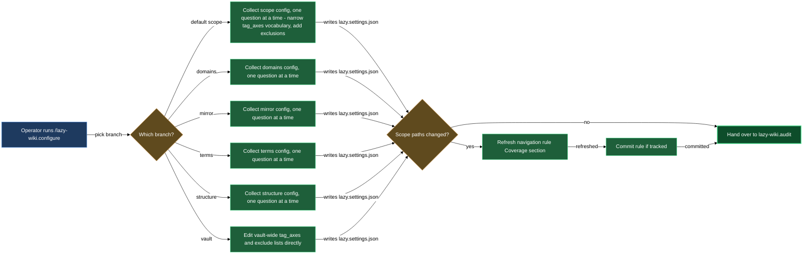

# Bootstrap and maintain lazycortex-wiki

Getting `lazycortex-wiki` running in a project takes three ordered moves: install the plugin infrastructure, configure at least one scope — and, as you need them, the plugin's other facilities (the vault-wide axis vocabulary and exclusion list, domain-spec generation, a mirrored foreign repo, a terms dictionary, the project-structure map) — then audit everything to confirm it stays coherent. After setup these same three skills remain your go-to tools whenever you add a scope, wire up a new facility, onboard a new contributor, or want a health check after a large restructure.

## When you'd use this

- Starting fresh: you've enabled the plugin and want the git-watch and weekly-scan routines running, the `wiki.curator` (plus `wiki.terms-curator`, `wiki.structure-curator`, and `wiki.tag-curator`) experts composed, the weekly `lazy-wiki.tag-normalize` sweep registered, and the navigation and structure rules synced.
- Adding a new scope to an existing install: run `/lazy-wiki.configure` to define the path globs, which axes of the vault's vocabulary this scope uses, and exclude globs beyond the repository-wide list, without touching the existing scopes — the topics-index path is derived from the scope's own first glob (`specs/**/*.md` puts the index at `specs/topics.md`) and the review-skip and folder-note filters are seeded automatically, so none of the three is asked. The mandatory `doc-kind` classification axis is already in the vault's vocabulary for you — it is never something you type in.
- Growing or trimming the vault's tag axis vocabulary, or the exclusions every scope inherits: run `/lazy-wiki.configure vault` to edit `tag_axes` and `exclude` directly, rather than through any one scope.
- Turning on domain-spec generation: run `/lazy-wiki.configure domains` to point the wiki at your code's `Domain(…)` markers and a dictionary of domain groups, so a docs tree gets generated and kept current.
- Mirroring a foreign repo's markdown into the vault: run `/lazy-wiki.configure mirror` against an existing scope so the mirrored files become ordinary wiki nodes, curated like anything local.
- Setting up a terms dictionary: run `/lazy-wiki.configure terms` so the documents in a scope share one agreed word per concept instead of drifting onto synonyms.
- Wiring the project-structure map: run `/lazy-wiki.configure structure` to define depth profiles and exclusions so three routines keep `docs/structure.md` current as files move.
- Verifying integrity after a large refactor or import: run `/lazy-wiki.audit` to surface orphan topics, broken See-also links, stale glosses, and index desync in the wiki scopes — plus terminology drift in any terms dictionary, divergence in the structure map, and a domain doc carrying a tag axis the vault vocabulary doesn't declare — before they accumulate.

## How it fits together

`/lazy-wiki.install` is the foundation. It detects whether the plugin is enabled at project or user scope, resolves the path for `lazy.settings.json`, creates the `~/.claude/templates/wiki/` (or `.claude/templates/wiki/`) directory, and syncs both rules the plugin ships — `lazy-wiki.navigation` and `lazy-wiki.structure` — into the consumer's rules directory. It seeds the `wiki`, `structure`, and `terms` settings sections (each idempotent — never overwritten once present); the `wiki` section carries a repository-wide axis vocabulary (`tag_axes`, seeded empty) that every scope only ever narrows from, and a repository-wide exclusion list (`exclude`, seeded with `docs/structure.md`) that every scope's own exclusions sit on top of — neither is a per-scope list. Install unconditionally unions the `doc-kind` classification axis, the mandatory dimension that says what a node is by form (`design`, `skill`, `rule`, …), into that repository-wide vocabulary — this runs again on every re-install, so the axis is already there before any scope exists, and a scope reaches it by narrowing the vault's vocabulary rather than declaring its own. It seeds agent-model tier entries for the curators and the domain-spec writer from `lazycortex-core`'s defaults, and composes four curator experts unconditionally — `wiki.curator`, `wiki.terms-curator`, `wiki.structure-curator`, and `wiki.tag-curator` (all four carry `can_commit_in_repo: true`, since each writes directly into the working tree — node content, the dictionary, the structure map, and the tag dictionary respectively). The **routines** are registered unconditionally too, exactly like the experts — a registered routine fires via `/lazy-runtime.tick` even on a checkout running no daemon, so `daemon.enabled` withholds nothing this skill writes (that flag only gates `lazy-core.install`'s supervisor unit and metrics endpoint): install registers a git-watch routine (`lazy-wiki.scan`) that processes changed files on every commit, a companion (`lazy-wiki.scan-deletes`) that prunes See-also links pointing at deleted nodes and rebuilds the topic index, a weekly full-scan (`lazy-wiki.relink-weekly`), a daily sanitizer (`lazy-wiki.doctor-apply`) that applies only the wiki CLI's pure index/link repairs across every scope and commits what it fixed, and a weekly tag-normalization sweep (`lazy-wiki.tag-normalize`) that dispatches `wiki.tag-curator` once per tag surface to consolidate the axis values actually in use into one canon and rewrite `docs/tags.md` — the advisory tag-values dictionary — to match. When `wiki.domains` is configured, install additionally composes the `wiki.domain-writer` expert and registers the two domain routines, unconditionally like the rest (`lazy-wiki.domain-scan` on every commit, `lazy-wiki.domain-full` weekly as insurance against a missed wake). For every scope carrying a `mirror` block, install registers that scope's own `lazy-wiki.mirror-sync.<scope-id>` schedule routine. As part of the install, it adds `Bash(lazycortex-wiki *)` to the project's `settings.local.json` allow-list so curator subprocesses dispatched by the daemon's `dontAsk` permission mode can reach the plugin CLI without being silently denied. The skill is idempotent: re-running it never overwrites values you've already customised, and if no scopes exist yet it points you at `/lazy-wiki.configure` rather than launching it for you.

`/lazy-wiki.configure` is the wizard, and it has grown six mutually exclusive branches — the plain invocation edits a **scope**; `domains`, `mirror`, `terms`, `structure`, and `vault` configure the plugin's other facilities. Every branch collects one question at a time and orients you first with a short summary of what it governs, so you're never answering in vocabulary you haven't seen defined.

- **Scope branch** (`/lazy-wiki.configure`) — the one you run first. It walks you through the scope id, path globs (markdown, code, or both), exclude paths beyond the repository-wide `wiki.exclude` list (skipped entirely for a scope covering the spec catalog — `/lazy-spec.install` already seeds those exclusions), and which of the vault's tag axes this scope narrows to (leave it blank and the scope speaks the whole vocabulary — a scope can only narrow the vault's axes, never widen them or invent one of its own). The `topics.md` index path is not asked: it is derived from the scope's own first glob and announced, so a scope covering `specs/**/*.md` indexes at `specs/topics.md`, beside the material it catalogues. Two sub-filters are seeded automatically and never asked either: `folder_note: false` (a note named after its own folder is a navigation node, not a document, and stays out of the wiki on every path) and a review-skip filter (documents currently under review, `review_active: true`, are left out of curation until review closes). Re-running with the same id enters edit mode. After writing the scope, it refreshes the `## Coverage` section of the installed `lazy-wiki.navigation` rule — one bullet per scope built from that scope's `paths`/`exclude_paths` — and commits the rule when it's tracked.
- **Domains branch** (`/lazy-wiki.configure domains`) — sets `wiki.domains`: the code globs to scan for `Domain(…)` markers (asked every run), the domain-groups dictionary path and the output directory for the generated docs tree (a first run takes the shipped defaults — `docs/guidelines/domain-groups.md` and `docs/domains` — without asking; only edit mode lets you move either), and the language to write the generated docs in (detected from your existing specs and offered as the default, asked every run). A missing dictionary file is seeded from a skeleton template. It warns when a configured wiki scope's globs already reach the output directory, since the tree is excluded from every scope structurally and such a glob claims nothing there.
- **Mirror branch** (`/lazy-wiki.configure mirror`) — nests a `mirror` block inside an **existing** scope: the source repo's git URL and branch, which markdown globs to pull (plus excludes for the source's own service files), and the vault directory the mirror lands in. It adds `<mirror_path>/**` to that scope's `paths` automatically, so the mirrored files become curated nodes without a second configuration step, and refreshes the navigation rule's Coverage the same way the scope branch does.
- **Terms branch** (`/lazy-wiki.configure terms`) — create, edit, or remove one scope of the `terms` section: which documents the dictionary serves and `source_exclude` — documents the dictionary still serves but never learns terms from (the dictionary itself, the standard tool-report globs, and optionally plan documents). The dictionary file is not asked about: a first run takes the shipped default `docs/terms.md`, created empty if absent and never truncated if it exists, and only edit mode moves it. It refuses a `paths` overlap with another terms scope up front, since one document can only belong to one dictionary, and automatically adds the dictionary file to any wiki scope's `exclude_paths` that would otherwise cover it. It also registers the scope's own `lazy-wiki.terms-scan-<id>` git-watch routine — unconditionally, same as every other wiki routine.
- **Structure branch** (`/lazy-wiki.configure structure`) — sets `depth_profiles` (named classes of globs, each with a depth of `file`, `dir`, or `brief`) and the `exclude` list for the fixed-path project-structure map, `docs/structure.md` (which is always kept in its own exclude list, so the map never describes itself). It registers three git-watch routines — for new, deleted, and renamed files — since `renamed_files` exposes different placeholders than the other two and needs its own request template; the map describes the tree's shape, not file contents, so the scan deliberately does not watch plain content edits — only a file appearing, disappearing, or moving triggers a dispatch. Once the routines are registered, the branch also builds the initial `docs/structure.md` itself when it's missing (via `/lazy-wiki.structure rebuild`), rather than leaving that as a step for you to remember — the routines only ever keep an existing map current, they never create one.
- **Vault branch** (`/lazy-wiki.configure vault`) — edits the two repository-wide keys directly rather than through any one scope: `tag_axes`, the closed axis vocabulary the whole vault classifies against, and `exclude`, the glob list unioned into every scope's `exclude_paths`. `doc-kind` and `docs/structure.md` stay put no matter what you type — dropping either here is undone by the next `/lazy-wiki.install` run — and removing any other axis is flagged before it's written, since every node already tagged on that axis goes unknown and every scope narrowed to it silently loses it.

`/lazy-wiki.audit` audits a single scope or every configured wiki scope, and — in the same run — the terms dictionaries and the structure map, if either is configured. It is read-only from start to finish: it never applies a repair itself, and it writes nothing. For wiki scopes it surfaces findings at three severities (`FAIL`, `WARN`, `INFO`) and labels which are fixable: orphan topics and index desync (repaired by rebuilding the topic index), non-canonical See-also link paths (rewritten to the canonical target), broken See-also lines (dropped), and stale glosses (refreshed) — each fixable finding names `Bash(lazycortex-wiki doctor <scope-id> --apply)` as its repair route, the same command the scheduled `lazy-wiki.doctor-apply` routine runs daily (with `--commit`) on your behalf, so you can either run it by hand or let the routine catch it. Everything else — including the domain-generation checks (a stale hash, an unknown group, a missing gloss, a scope glob reaching the structurally-excluded output tree, a generated domain doc carrying a `wiki/<axis>/…` tag whose axis isn't in `wiki.tag_axes`) and the mirror checks (an orphaned clone, local edits a sync would overwrite, `paths` not covering `mirror_path`) — is report-only, with its own hand-repair route named alongside the finding. For terms scopes and the structure map, the audit pairs two kinds of check: configuration and format problems the skill judges directly by reading (a missing dictionary file, overlapping scope globs, a routine whose filter no longer matches, one of the structure map's three scan routines registered while `docs/structure.md` doesn't exist yet, `docs/structure.md` missing from the repository-wide `wiki.exclude` while some scope's `paths` still cover it), and meaning problems it hands to the owning curator in report mode — `wiki.terms-curator` returns divergence / missing / duplicate / dead terms, `wiki.structure-curator` returns entries the map and the tree disagree on. Neither curator writes anything in this mode. Every finding the audit prints carries its own repair route; terms and structure findings are never batch-applied — each is decided with you one at a time, since which word is "right" is a judgment call, not a default, and a document under active review or inside an upstream mirror is never touched either way.

## Common adjustments

**Changing a scope's path globs, exclude paths, or which vault axes it narrows to** — run `/lazy-wiki.configure` again with the same scope id. Edit mode shows the current values so you can update only what you need; the navigation rule's Coverage section refreshes to match automatically. The review-skip and folder-note filters are seeded automatically rather than asked — edit `lazy.settings.json[wiki.scopes][<id>].filter` by hand for a different predicate.

**Growing, trimming, or renaming the vault's tag axis vocabulary, or its repository-wide exclusions** — run `/lazy-wiki.configure vault`; it shows the current `tag_axes` and `exclude`, keeps `doc-kind` and `docs/structure.md` in place regardless of what you type, and warns you before writing a set that drops an axis some node already carries. This is also the fix when `/lazy-wiki.audit` reports a generated domain doc using a tag axis the vault vocabulary doesn't declare — either the axis belongs in `wiki.tag_axes`, or the dictionary group's tag needs correcting.

**Adjusting domain-spec generation** — run `/lazy-wiki.configure domains` again; it shows the current code globs, dictionary path, output directory, and language and lets you change any of them.

**Changing a mirror's source or destination** — run `/lazy-wiki.configure mirror` again against the same scope; re-running install afterwards registers the schedule routine if it isn't already.

**Editing a terms dictionary's scope, or removing one** — run `/lazy-wiki.configure terms`; the remove path offers to keep or delete the dictionary file and cleans up the wiki-side `exclude_paths` entry it had added.

**Reshaping the structure map's classes or depths** — run `/lazy-wiki.configure structure`; existing classes are offered for keep/change/remove before you're asked about new ones.

**Checking one scope rather than all** — pass the scope id: `/lazy-wiki.audit <scope-id>`. Omit it to audit every configured wiki scope, plus every terms scope and the structure map, in one pass.

**Updating the rules after a plugin upgrade** — re-run `/lazy-wiki.install`. The rules are install-managed mirrors, so a copy that differs from the shipped source is overwritten from it on the spot: byte comparison decides, and there is no diff preview, no merge, and no question. If you want different content, author your own rule file beside the mirror rather than editing it — an edited mirror is a stale copy by construction and will be replaced on the next run.

**Changing the agent-model tier for a curator or the domain writer** — run `/lazy-core.agent-models` to adjust the tier; `lazy-wiki.install` seeds the defaults but never overwrites a value you've already set.

## How the setup flow connects

The three skills run in order; each part below is one of them.

### Install

<!-- /lazy-diagram.draw lands the fence here; do not author a code block manually. -->

```mermaid
%%{init: {'themeVariables':{'background':'transparent','lineColor':'#000','textColor':'#000','edgeLabelBackground':'#fff'},'themeCSS':'.edgeLabel{background-color:transparent!important}.edgeLabel p{background-color:transparent!important}','flowchart':{'diagramPadding':5,'useMaxWidth':true}}}%%
flowchart LR
  installRunsWikiInstall["lazy-wiki.install runs"]
  writeSettingsSections["Write wiki, structure, terms settings sections"]
  seedTagAxesAndExclude["Seed tag_axes empty, exclude docs/structure.md"]
  unionDocKindAxis["Union doc-kind axis into vocabulary"]
  composeCoreExperts["Compose wiki.curator, wiki.terms-curator, wiki.structure-curator, wiki.tag-curator"]
  registerCoreRoutines["Register lazy-wiki.scan, scan-deletes, relink-weekly, doctor-apply, tag-normalize"]
  domainsConfigured{"wiki.domains configured?"}
  addDomainWriter["Add wiki.domain-writer expert plus two domain routines"]
  registerMirrorSyncRoutines["Register one lazy-wiki.mirror-sync per mirror scope"]
  overwriteDivergedMirrors["Overwrite every diverged rule mirror from shipped source"]
  handOffToConfigure["Hand over to lazy-wiki.configure"]

  installRunsWikiInstall -->|seeds settings| writeSettingsSections
  writeSettingsSections -->|seeds vocabulary| seedTagAxesAndExclude
  seedTagAxesAndExclude -->|unions axis| unionDocKindAxis
  unionDocKindAxis -->|composes experts| composeCoreExperts
  composeCoreExperts -->|registers routines| registerCoreRoutines
  registerCoreRoutines -->|checks config| domainsConfigured
  domainsConfigured -->|configured| addDomainWriter
  domainsConfigured -->|not configured| registerMirrorSyncRoutines
  addDomainWriter -->|continues| registerMirrorSyncRoutines
  registerMirrorSyncRoutines -->|syncs rules| overwriteDivergedMirrors
  overwriteDivergedMirrors -->|hands over| handOffToConfigure

  classDef entry fill:#1e3a5f,stroke:#4a90e2,color:#fff
  classDef guard fill:#5f4a1e,stroke:#e2a14a,color:#fff
  classDef action fill:#1e5f3a,stroke:#4ae290,color:#fff
  classDef success fill:#0d4d2a,stroke:#4ae290,color:#fff,stroke-width:2px

  class installRunsWikiInstall entry
  class writeSettingsSections action
  class seedTagAxesAndExclude action
  class unionDocKindAxis action
  class composeCoreExperts action
  class registerCoreRoutines action
  class domainsConfigured guard
  class addDomainWriter action
  class registerMirrorSyncRoutines action
  class overwriteDivergedMirrors action
  class handOffToConfigure success
```

### Configure

<!-- /lazy-diagram.draw lands the fence here; do not author a code block manually. -->

```mermaid
%%{init: {'themeVariables':{'background':'transparent','lineColor':'#000','textColor':'#000','edgeLabelBackground':'#fff'},'themeCSS':'.edgeLabel{background-color:transparent!important}.edgeLabel p{background-color:transparent!important}','flowchart':{'diagramPadding':5,'useMaxWidth':true}}}%%
flowchart LR
  invokeConfigure["Operator runs /lazy-wiki.configure"]
  selectBranch{"Which branch?"}
  collectScope["Collect scope config, one question at a time - narrow tag_axes vocabulary, add exclusions"]
  collectDomains["Collect domains config, one question at a time"]
  collectMirror["Collect mirror config, one question at a time"]
  collectTerms["Collect terms config, one question at a time"]
  collectStructure["Collect structure config, one question at a time"]
  editVault["Edit vault-wide tag_axes and exclude lists directly"]
  didScopePathsChange{"Scope paths changed?"}
  refreshCoverage["Refresh navigation rule Coverage section"]
  commitRule["Commit rule if tracked"]
  handoverAudit["Hand over to lazy-wiki.audit"]

  invokeConfigure -->|pick branch| selectBranch
  selectBranch -->|default scope| collectScope
  selectBranch -->|domains| collectDomains
  selectBranch -->|mirror| collectMirror
  selectBranch -->|terms| collectTerms
  selectBranch -->|structure| collectStructure
  selectBranch -->|vault| editVault
  collectScope -->|writes lazy.settings.json| didScopePathsChange
  collectDomains -->|writes lazy.settings.json| didScopePathsChange
  collectMirror -->|writes lazy.settings.json| didScopePathsChange
  collectTerms -->|writes lazy.settings.json| didScopePathsChange
  collectStructure -->|writes lazy.settings.json| didScopePathsChange
  editVault -->|writes lazy.settings.json| didScopePathsChange
  didScopePathsChange -->|yes| refreshCoverage
  didScopePathsChange -->|no| handoverAudit
  refreshCoverage -->|refreshed| commitRule
  commitRule -->|committed| handoverAudit

  classDef entry fill:#1e3a5f,stroke:#4a90e2,color:#fff
  classDef guard fill:#5f4a1e,stroke:#e2a14a,color:#fff
  classDef action fill:#1e5f3a,stroke:#4ae290,color:#fff
  classDef success fill:#0d4d2a,stroke:#4ae290,color:#fff,stroke-width:2px

  class invokeConfigure entry
  class selectBranch guard
  class collectScope action
  class collectDomains action
  class collectMirror action
  class collectTerms action
  class collectStructure action
  class editVault action
  class didScopePathsChange guard
  class refreshCoverage action
  class commitRule action
  class handoverAudit success
```

### Audit

<!-- /lazy-diagram.draw lands the fence here; do not author a code block manually. -->

```mermaid
%%{init: {'themeVariables':{'background':'transparent','lineColor':'#000','textColor':'#000','edgeLabelBackground':'#fff'},'themeCSS':'.edgeLabel{background-color:transparent!important}.edgeLabel p{background-color:transparent!important}','flowchart':{'diagramPadding':5,'useMaxWidth':true}}}%%
flowchart LR
  invokeAudit["/lazy-wiki.audit invoked"]
  runCliAudit["Run lazycortex-wiki doctor via CLI"]
  scopeValid{"Scope known?"}
  stopUnknownScope["Exit non-zero, stop"]
  auditTermsAndStructure["Read terms scopes and structure map config, dispatch curators in report mode"]
  presentFindings["Present findings by severity, label fixable ones"]
  nameRepairRoute["Name lazycortex-wiki doctor scope-id --apply as repair route"]
  reportOnly["Report delivered, skill writes nothing"]
  handApply["Run by hand"]
  dailyRoutine["Applied daily by lazy-wiki.doctor-apply routine"]
  lazyWikiHelp["/lazy-wiki.help - optional orientation anytime"]

  invokeAudit -->|runs| runCliAudit
  runCliAudit -->|validates| scopeValid
  scopeValid -->|unknown scope| stopUnknownScope
  scopeValid -->|valid| auditTermsAndStructure
  auditTermsAndStructure -->|reports| presentFindings
  presentFindings -->|labels fixable findings| nameRepairRoute
  nameRepairRoute -->|writes nothing| reportOnly
  nameRepairRoute -->|run by hand| handApply
  nameRepairRoute -->|scheduled daily| dailyRoutine
  invokeAudit -->|optional anytime| lazyWikiHelp

  classDef entry fill:#1e3a5f,stroke:#4a90e2,color:#fff
  classDef guard fill:#5f4a1e,stroke:#e2a14a,color:#fff
  classDef action fill:#1e5f3a,stroke:#4ae290,color:#fff
  classDef success fill:#0d4d2a,stroke:#4ae290,color:#fff,stroke-width:2px
  classDef error fill:#5f1e1e,stroke:#e24a4a,color:#fff,stroke-width:2px

  class invokeAudit entry
  class runCliAudit action
  class scopeValid guard
  class stopUnknownScope error
  class auditTermsAndStructure action
  class presentFindings action
  class nameRepairRoute action
  class reportOnly success
  class handApply success
  class dailyRoutine success
  class lazyWikiHelp action
```

## See also

- **audit** block — once scopes are running, the `wiki.audit` skill also appears in the `audit` block alongside the broader integrity tooling.
- **curation** block — after setup, the `wiki.relink` skill drives the actual per-node curation; the `wiki.curator` expert registered here is what it dispatches.
- **domains** block — once `/lazy-wiki.configure domains` is set up, this is where you query the generated domain-spec tree it produces.
- **terms** block — once `/lazy-wiki.configure terms` is set up, this is where writers consult the dictionary this block builds.
- **structure** block — once `/lazy-wiki.configure structure` is set up, this is where you query the project-structure map the registered routines keep current.
