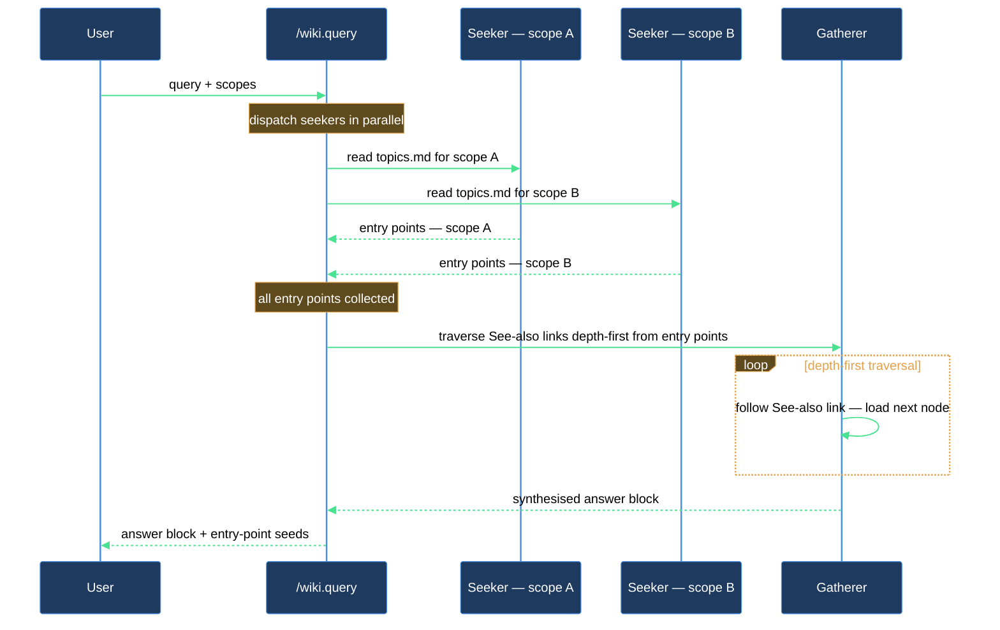

# Wiki query

Asking a question about your codebase or documentation through `/wiki.query` gives you a synthesised, citation-backed answer sourced from the wiki graph — without loading the full topic catalog or every traversed document into your conversation. The skill is a thin two-phase dispatcher: in the first phase it asks one seeker per configured wiki scope to scan its `topics.md` and identify the nodes most relevant to your question; in the second phase a single gatherer opens those entry-point nodes, follows their glossed See-also links selectively, and writes a grounded answer with links to every source it touched. Your session context sees only the entry-point list and the final answer.

The seeker and gatherer subagents each run in their own isolated context. The seeker's context holds the full `topics.md` catalog for one scope; the gatherer's context holds the traversed node bodies. Neither of those potentially large data sets leaks into your main conversation.

## When you'd use this

- Getting a concise explanation of a concept that is spread across multiple wiki nodes in your codebase.
- Finding out which modules, services, or documents relate to a given topic without manually reading the topic index.
- Tracking down the authoritative source for a design decision recorded in the wiki.
- Asking follow-up questions about your project's architecture using the curated, maintained knowledge layer rather than raw grep.

## How it fits together

You invoke `/wiki.query "<question>"` and the skill does the rest in two ordered phases.

**Phase 1 — Seeking entry points.** The skill reads your wiki scope configuration and, for each scope that has a `topics_index` on disk, dispatches a seeker subagent in parallel. Each seeker receives the question and the absolute path to its scope's `topics.md`. It reads that index — a structured tree of axis/value/node entries, each with a one-line summary — and returns the nodes most relevant to the question, ranked by apparent relevance with a short reason for each match. The seeker never opens node files; it works entirely from the index. When multiple scopes are configured, all seekers run simultaneously and their results are merged.

The skill then validates every returned path on disk and rebases it to a repo-relative form. Any path that doesn't exist on disk is dropped and noted so you can see what the seeker suggested but couldn't deliver.

**Phase 2 — Traversal and synthesis.** With the validated entry points in hand, the skill dispatches a single gatherer subagent. The gatherer opens each entry-point node in turn, scans its `# See also` section, and decides — from the gloss text alone — whether a linked node is relevant enough to follow. Glosses are one-line descriptions of the link target, maintained by the curator; they let the gatherer skip whole branches without reading them. The gatherer follows relevant links depth-first up to roughly three hops from any seed, also running backlink searches (grep) when "what points to this node" matters for the question. Once the frontier stabilises it writes a synthesised answer with inline source links, then a sources list naming every node it read.

**Presenting the result.** The skill surfaces the gatherer's answer and sources verbatim, and appends the entry-point seed — path, gloss, and scope for each point — plus any dropped paths. You can see exactly where the traversal started and whether anything was filtered out.

If no scope has a topic index on disk, or if the seekers find no relevant entry points, the skill tells you so directly rather than returning an empty result silently.

## Common adjustments

- **Multiple scopes.** If your project has several wiki scopes (e.g. one for source, one for docs), seekers run in parallel across all of them. Run `/lazy-wiki.configure` to add, edit, or remove scopes and their `topics_index` paths.
- **Index out of date.** The seeker draws only from `topics.md`. If a recently added node hasn't been indexed yet, it won't appear as an entry point. Run `/lazy-wiki.relink` to bring the index up to date, or wait for the next scheduled relink routine.
- **Cross-repo links.** If your wiki scopes span multiple repositories, the gatherer resolves `@<repo-key>/…` links via the `repos` registry in your wiki settings. Add or update repo entries via `/lazy-wiki.configure`.

## How the query pipeline works

## See also

- [curation](curation.md) — how nodes get their summaries, tags, and See-also glosses that the query block depends on.
- [audit](audit.md) — check for missing summaries, stale glosses, or broken See-also links that would degrade query results.
