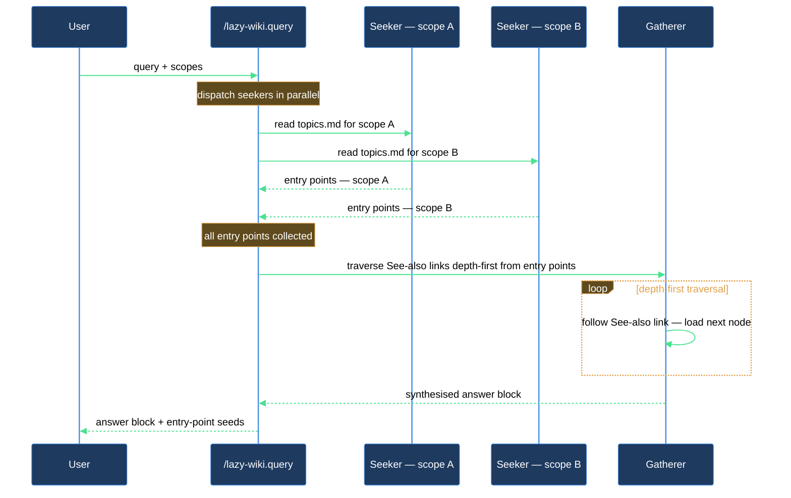

# Wiki query

Asking a question about your codebase or documentation through `/lazy-wiki.query` gives you a synthesised, citation-backed answer sourced from the wiki graph — without loading the full topic catalog or every traversed document into your conversation. The skill runs in one of two modes, chosen automatically by whether the executing agent has the `Agent` tool: **dispatcher mode**, where a `lazy-wiki.seeker` picks entry points per scope and a `lazy-wiki.gatherer` traverses from them, keeping the large topic catalog and traversed node bodies in their own isolated contexts; and **agentless mode**, where the same lookup happens directly in the executing agent's own context because there is no subagent to hand it off to. Either way, you get back a grounded answer plus the entry points it started from.

## When you'd use this

- Getting a concise explanation of a concept that is spread across multiple wiki nodes in your codebase.
- Finding out which modules, services, or documents relate to a given topic without manually reading the topic index.
- Tracking down the authoritative source for a design decision recorded in the wiki.
- Asking follow-up questions about your project's architecture using the curated, maintained knowledge layer rather than raw grep.
- Before falling back to grep or opening files by hand in a scope the wiki covers — once a wiki scope is installed, the shipped `lazy-wiki.navigation` rule makes `/lazy-wiki.query` mandatory first, not just convenient.

## How it fits together

You invoke `/lazy-wiki.query "<question>"`. The skill first decides which mode it's running in: if the agent executing it can call the `Agent` tool — the main session, or a subagent whose own tool list carries `Agent` — it runs **dispatcher mode**. If it's a one-shot context with no further fan-out capability (an expert job, or a subagent dispatched without `Agent`), it runs **agentless mode**, doing the same lookup itself because there's nowhere else to put it.

### Dispatcher mode

**Phase 1 — Seeking entry points.** The skill reads your wiki scope configuration and, for each scope that has a `topics_index` on disk, dispatches a `lazy-wiki.seeker` subagent in parallel. Each seeker receives the question and the absolute path to its scope's `topics.md`. It reads that index — a structured tree of axis/value/node entries, each with a one-line summary — and returns the nodes most relevant to the question, ranked by apparent relevance with a short reason for each match. The seeker never opens node files; it works entirely from the index. When multiple scopes are configured, all seekers run simultaneously and their results are merged.

The skill then validates every returned path on disk and rebases it to a repo-relative form. Any path that doesn't exist on disk is dropped and noted so you can see what the seeker suggested but couldn't deliver.

**Phase 2 — Traversal and synthesis.** With the validated entry points in hand, the skill dispatches a single `lazy-wiki.gatherer` subagent. The gatherer opens each entry-point node in turn, scans its `# See also` section, and decides — from the gloss text alone — whether a linked node is relevant enough to follow. Glosses are one-line descriptions of the link target, maintained by the curator; they let the gatherer skip whole branches without reading them. The gatherer follows relevant links depth-first up to roughly three hops from any seed, also running backlink searches (grep) when "what points to this node" matters for the question. Once the frontier stabilises it writes a synthesised answer with inline source links, then a sources list naming every node it read.

**Presenting the result.** The skill surfaces the gatherer's answer and sources verbatim, and appends the entry-point seed — path, gloss, and scope for each point — plus any dropped paths. You can see exactly where the traversal started and whether anything was filtered out.

Your session context sees only the entry-point list and the final answer — the seeker's `topics.md` catalog and the gatherer's traversed node bodies stay in their own isolated subagent contexts.

### Agentless mode

When there's no `Agent` tool to dispatch a seeker or gatherer to, the executing context does the same two steps itself: it reads each configured scope's `topics.md` directly and picks the entry points a seeker would, then reads those nodes and follows their glossed See-also links (falling back to a grep-based backlink search when needed) the way a gatherer would — bounded to what the question needs rather than an exhaustive walk. It synthesises the same answer-plus-sources shape and presents it the same way. Nothing about the output changes; only where the traversal happens does.

If no scope has a topic index on disk, or if no entry points are found, the skill tells you so directly rather than returning an empty result silently — in either mode.

## Common adjustments

- **Multiple scopes.** If your project has several wiki scopes (e.g. one for source, one for docs), dispatcher mode runs a seeker per scope in parallel; agentless mode reads each scope's index in turn. Run `/lazy-wiki.configure` to add, edit, or remove scopes and their `topics_index` paths.
- **Index out of date.** Both modes draw entry points only from `topics.md`. If a recently added node hasn't been indexed yet, it won't appear as an entry point. Run `/lazy-wiki.relink` to bring the index up to date, or wait for the next scheduled relink routine. `/lazy-wiki.relink` is the daemon-free way to do this in-session: it classifies and links every changed node, rebuilds `topics.md` once, and commits the result under your identity — useful when you don't run the runtime daemon, or want to force a refresh right before a query.
- **Cross-repo links.** If your wiki scopes span multiple repositories, traversal resolves `@<repo-key>/…` links via the `repos` registry in your wiki settings. Add or update repo entries via `/lazy-wiki.configure`.
- **Running inside an expert job or a subagent without fan-out.** These contexts have no `Agent` tool, so `/lazy-wiki.query` automatically falls back to agentless mode — nothing to configure. It's the same lookup, just without the isolated seeker/gatherer contexts, because there's no downstream context to protect.
- **Deciding whether a question is covered.** The `lazy-wiki.navigation` rule that ships with the plugin carries a `## Coverage` section listing each scope's `paths` globs; `/lazy-wiki.configure` rewrites that section whenever a scope is created or edited. That's what lets any agent working in the repo tell — without opening the wiki — whether your question falls inside a scope the wiki curates. When it does, the rule requires `/lazy-wiki.query` to run before Grep, Glob, or opening a file directly; grepping the scope blind, opening nodes one by one to find the relevant one, and answering from memory of an earlier session are each called out as the violation the rule forbids. Outside a covered scope, work continues normally.

## How the query pipeline works

```mermaid
%%{init: {'themeVariables':{'background':'transparent','primaryColor':'#1e3a5f','primaryBorderColor':'#4a90e2','primaryTextColor':'#fff','lineColor':'#4ae290','actorBkg':'#1e3a5f','actorBorder':'#4a90e2','actorTextColor':'#fff','actorLineColor':'#4a90e2','signalColor':'#4ae290','signalTextColor':'#000','noteBkgColor':'#5f4a1e','noteBorderColor':'#e2a14a','noteTextColor':'#fff','labelBoxBkgColor':'#5f4a1e','labelBoxBorderColor':'#e2a14a','labelTextColor':'#fff','loopTextColor':'#e2a14a'},'sequence':{'diagramPadding':5,'useMaxWidth':true}}}%%
sequenceDiagram
  participant user as User
  participant skill as /lazy-wiki.query
  participant seekerA as Seeker — scope A
  participant seekerB as Seeker — scope B
  participant gatherer as Gatherer

  user->>skill: query + scopes

  Note over skill: dispatch seekers in parallel

  skill->>seekerA: read topics.md for scope A
  skill->>seekerB: read topics.md for scope B

  seekerA-->>skill: entry points — scope A
  seekerB-->>skill: entry points — scope B

  Note over skill: all entry points collected

  skill->>gatherer: traverse See-also links depth-first from entry points

  loop depth-first traversal
    gatherer->>gatherer: follow See-also link — load next node
  end

  gatherer-->>skill: synthesised answer block

  skill-->>user: answer block + entry-point seeds
```

## See also

- [curation](curation.md) — how nodes get their summaries, tags, and See-also glosses that the query block depends on.
- [audit](audit.md) — check for missing summaries, stale glosses, or broken See-also links that would degrade query results.
