# Troubleshooting

## `/wiki.install` aborts: "lazycortex-wiki not enabled"

**Symptom**: Running `/wiki.install` immediately stops with the message "lazycortex-wiki not enabled — add `"lazycortex-wiki@lazycortex": true` to `enabledPlugins` in your `settings.json` and run `/plugin install lazycortex/lazycortex-wiki`."

**Likely cause**: The plugin is not listed in `enabledPlugins` in your `~/.claude/settings.json`, so the installer cannot locate an entry for `lazycortex-wiki@lazycortex` in the installed-plugins registry.

**Fix**: Add `"lazycortex-wiki@lazycortex": true` under `enabledPlugins` in your global `~/.claude/settings.json`, restart Claude Code, and re-run `/wiki.install`.

---

## `/wiki.install` aborts: "lazycortex-core not installed"

**Symptom**: `/wiki.install` stops with "lazycortex-core not installed; install it before /wiki.install."

**Likely cause**: The installer could not find `default-tiers.json` from `lazycortex-core` — either the `lazycortex-core` plugin is not enabled, or its cache is absent.

**Fix**: Enable `lazycortex-core` in `enabledPlugins` (same `settings.json`) and restart Claude Code so the cache is populated, then re-run `/wiki.install`.

---

## `/wiki.install` aborts: "plugin cache is empty"

**Symptom**: `/wiki.install` stops with "Plugin cache is empty — run `/plugin update lazycortex-wiki@lazycortex` to refresh."

**Likely cause**: The plugin was enabled in settings but the local cache directory has not been populated, so the rule-file glob found nothing.

**Fix**: Run `/plugin update lazycortex-wiki@lazycortex` in Claude Code to fetch the plugin files, then re-run `/wiki.install`.

---

## `/wiki.configure` aborts: "Run `/wiki.install` first"

**Symptom**: Starting `/wiki.configure` produces the message "Run `/wiki.install` first" or "Run `/wiki.install` first — the `wiki` section is missing."

**Likely cause**: Either `lazy.settings.json` does not exist in the project yet, or it exists but is missing the top-level `wiki` key that `/wiki.install` seeds.

**Fix**: Run `/wiki.install` to create the settings file and seed the `wiki` section, then re-run `/wiki.configure`.

---

## `/wiki.configure` keeps re-asking for a scope id

**Symptom**: The scope id prompt repeats without accepting the value you entered.

**Likely cause**: The id you provided doesn't match the required format — it must start with a lowercase letter and contain only lowercase letters, digits, hyphens, or underscores (`^[a-z][a-z0-9_-]*$`). Uppercase letters, spaces, or leading digits cause the wizard to re-ask.

**Fix**: Enter a valid slug, for example `docs`, `codebase`, or `my-notes`.

---

## `/wiki.query` reports "No wiki scopes configured"

**Symptom**: `/wiki.query "<question>"` exits immediately with "No wiki scopes configured — run `/wiki.install` and `/wiki.configure` first."

**Likely cause**: `lazy.settings.json` is absent or `wiki.scopes` is empty — no scope has been defined for this repository.

**Fix**: Run `/wiki.install` (if not done), then `/wiki.configure` to define at least one scope, and re-run the query.

---

## `/wiki.query` returns "No wiki material matched this question"

**Symptom**: The query completes without error but reports "No wiki material matched this question." — no answer, no sources.

**Likely cause**: Either the `topics.md` file for the configured scope does not yet exist on disk (the scope was configured but never linked), or none of the topics in the index are relevant to the question.

**Fix**: Run `/wiki.relink` for the scope to build the initial `topics.md` and classify and link all nodes in the scope. After the relink completes, re-run the query. If the index already exists but the question genuinely has no coverage, the answer reflects real absence — consider whether the relevant documentation is in scope.

---

## `/wiki.doctor` reports "unknown scope '<id>'"

**Symptom**: Running `/wiki.doctor <id>` outputs "unknown scope '<id>'" and stops.

**Likely cause**: The scope id passed to `/wiki.doctor` does not match any key in `lazy.settings.json[wiki.scopes]` — it was misspelled, or the scope has not been created yet.

**Fix**: Run `/wiki.configure` to create a scope with the intended id, or re-invoke `/wiki.doctor` with a scope id that already exists. The configured scope ids are visible in `lazy.settings.json` — run `/wiki.configure` to review or add them.

---

## `/wiki.relink` reports "unknown scope '<id>'"

**Symptom**: `/wiki.relink <id>` stops with "unknown scope '<id>'".

**Likely cause**: The scope id is not present in `lazy.settings.json[wiki.scopes]` — it was not created with `/wiki.configure`, or was removed.

**Fix**: Run `/wiki.configure` to define the scope, then re-run `/wiki.relink <id>`.

---

## `/wiki.relink` produces `anchor-lost` mode unexpectedly

**Symptom**: The relink report shows `planned:anchor-lost` rather than `planned:incremental`, and processes many more nodes than expected.

**Likely cause**: The `wiki_synced_sha` anchor commit became unreachable — typically because of a rebase, `git reset --hard`, a squash, or a shallow clone that pruned the commit the anchor pointed to. The planner falls back to a content-hash backstop (`wiki_src_hash`) to determine what needs relinking.

**Fix**: This is expected recovery behaviour, not an error. Let the relink complete normally — it will process the nodes identified by the content-hash backstop and write a fresh anchor at the current HEAD when it commits. Future incremental relinking will work from this new anchor.

---

## A curator subagent errors during `/wiki.relink` and a node is skipped

**Symptom**: During `/wiki.relink`, the skill reports one or more nodes as skipped with a curator error, then continues. The skipped nodes are not classified or linked.

**Likely cause**: The curator subagent encountered a problem applying curation to a specific node — for example, a malformed `apply-node` input, a schema violation in the node's existing wiki frontmatter, or a file the curator could not read.

**Fix**: The remaining nodes in the run are unaffected. The skipped node will be picked up automatically on the next `/wiki.relink` run (it will appear in the plan's `classify[]` or `link[]` set again). If the same node is skipped repeatedly, inspect that node's wiki frontmatter for unexpected values and run `/wiki.doctor` to surface any `broken-wiki-block` findings.

---

## Diagnostic flowchart

```mermaid
%%{init: {'themeVariables':{'lineColor':'#000','textColor':'#000','edgeLabelBackground':'#fff'},'themeCSS':'.edgeLabel{background-color:transparent!important}.edgeLabel p{background-color:transparent!important}','flowchart':{'diagramPadding':5,'useMaxWidth':true}}}%%
flowchart TD
  rootSkill{Which skill produced the error?}

  installBranch{Install/Configure failure type?}
  queryBranch{Query failure type?}
  relinkBranch{Relink failure type?}
  doctorBranch{Doctor failure type?}

  installMissing[Troubleshoot: dependency missing — run install with verbose flag and check PATH]
  installConfig[Troubleshoot: config validation error — verify config schema and required fields]
  installPerm[Troubleshoot: permission denied during install — check directory ownership and sudo requirements]

  queryNoResults[Troubleshoot: query returns empty — verify index is built and filters match stored data]
  queryTimeout[Troubleshoot: query times out — reduce result limit or rebuild index]
  queryParse[Troubleshoot: query parse error — check query syntax and escape special characters]

  relinkBroken[Troubleshoot: broken symlink — re-run relink with force flag to regenerate targets]
  relinkConflict[Troubleshoot: link conflict — remove stale link manually then relink]
  relinkNotFound[Troubleshoot: source path not found — confirm source exists before relinking]

  doctorFail[Troubleshoot: doctor check failed — inspect reported check name and follow remediation step]
  doctorMissing[Troubleshoot: required tool missing — install missing tool listed in doctor output]
  doctorVersion[Troubleshoot: version mismatch — upgrade or pin the tool to the required version]

  rootSkill -->|install-configure| installBranch
  rootSkill -->|query| queryBranch
  rootSkill -->|relink| relinkBranch
  rootSkill -->|doctor| doctorBranch

  installBranch -->|missing dependency| installMissing
  installBranch -->|config invalid| installConfig
  installBranch -->|permission denied| installPerm

  queryBranch -->|no results| queryNoResults
  queryBranch -->|timeout| queryTimeout
  queryBranch -->|parse error| queryParse

  relinkBranch -->|broken link| relinkBroken
  relinkBranch -->|link conflict| relinkConflict
  relinkBranch -->|source not found| relinkNotFound

  doctorBranch -->|check failed| doctorFail
  doctorBranch -->|tool missing| doctorMissing
  doctorBranch -->|version mismatch| doctorVersion

  classDef guard fill:#5f4a1e,stroke:#e2a14a,color:#fff
  classDef success fill:#0d4d2a,stroke:#4ae290,color:#fff,stroke-width:2px
  classDef error fill:#5f1e1e,stroke:#e24a4a,color:#fff,stroke-width:2px

  class rootSkill guard
  class installBranch guard
  class queryBranch guard
  class relinkBranch guard
  class doctorBranch guard
  class installMissing error
  class installConfig error
  class installPerm error
  class queryNoResults error
  class queryTimeout error
  class queryParse error
  class relinkBroken error
  class relinkConflict error
  class relinkNotFound error
  class doctorFail success
  class doctorMissing success
  class doctorVersion success
```

