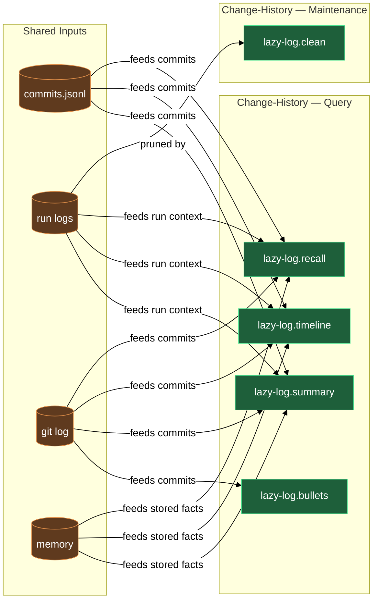

# Change history and run-log housekeeping

Every commit your project lands is recorded, and every skill or agent that opts into logging leaves a run log behind — but that record is only useful when the logs stay tidy and you can query them. This block covers both sides: `/lazy-log.clean` keeps the `.logs/claude/` tree free of orphaned directories left behind by renamed or retired skills, and three query agents answer "why", "when", and "tell me the whole story" across run logs, the raw commit journal, git log, and memory at once.

## What's in this block

**`lazy-log.clean`** is the interactive log-tree janitor. It resolves the live set of canonical skill, agent, and command names from your vault, then classifies every subdirectory of `.logs/claude/` into buckets: canonical, unlogged (a live artifact that no longer opts into logging, so its folder is leftover residue), rename-candidate (fuzzy-matched against a known name), pattern-clustered orphan (anonymous `task-N` or `subagent-task-N` folders), and unknown. For each non-canonical bucket it asks you what to do — merge into the canonical name, archive the substantive logs into memory and then delete, delete outright, or leave — and applies every choice in one final pass.

**`lazy-log.recall`** answers point-in-time questions: "why was X changed?" or "when did we touch Y?". You give it a natural-language query; it decomposes the query into keywords (including plural and singular variants and obvious synonyms), searches run logs, `.logs/commits.jsonl`, git log (both message and diff-content search), and project memory, ranks matches by source quality, deduplicates by commit SHA, and returns a table you can jump from with `git show <sha>`.

**`lazy-log.timeline`** takes a date range or topic — or both combined — and produces a chronological, newest-first, day-by-day listing of everything that matches, drawn from the same sources. It is the right tool when you want a "what happened when" overview rather than a specific answer. If no date range is given it defaults to the last 7 days.

**`lazy-log.summary`** aggregates every match for a topic and synthesizes a multi-paragraph narrative: why the work started, what was done, what issues came up, and where it ended up. Unlike `recall` (point-in-time) and `timeline` (chronological), `summary` clusters by sub-theme — design decisions, implementation phases, issues encountered, follow-up work — and writes prose for a reader who was not there.

**`lazy-log.bullets`** is the release-time tool. You dispatch it with a plugin name, the commit range since the last release, the new version, and the date. It reads the commits, drops anything purely internal (chore, style, test, docs-sync), rewrites the survivors as outcome-led bullets grouped by scope (with any `#` token from a commit subject wrapped in backticks for tag safety), and returns a release block ready to prepend to `CHANGELOG.public.md`.

## How they work together

The block divides into two groups: **maintenance** and **querying**.

On the maintenance side, `/lazy-log.clean` is the keeper of record quality. Run it when `.logs/claude/` has accumulated folders from renamed or retired skills — it removes the noise without destroying historical value, offering an archive-to-memory path for any logs worth keeping. The raw commit feed needs no maintenance: the `lazy-log.commit-recorder` hook appends one line to `.logs/commits.jsonl` after every successful commit — including commits made through a chained Bash command — and the runtime daemon keeps the journal within its size budget.

On the query side, the three search agents draw from the same four sources — run logs, raw commits, git log, memory — and differ in the shape of question each answers:

| Agent | Best for |
|---|---|
| `lazy-log.recall` | A specific question: "who changed the auth middleware?" |
| `lazy-log.timeline` | A window in time: "what happened last week?" |
| `lazy-log.summary` | The full arc: "tell me the whole story of the logging refactor" |

All three return git SHAs so you can `git show <sha>` to inspect the exact change. `lazy-log.recall` broadens its search automatically by including plural and singular variants and obvious synonyms; narrow it by passing more specific keywords in a follow-up prompt.

`lazy-log.recall`, `lazy-log.timeline`, and `lazy-log.summary` all write their own prose in the project's configured language — the top-level `language` key in `.claude/lazy.settings.json`, falling back to English when the key is absent — before producing a single line of output. Only quoted source material stays as-is: commit subjects, file paths, SHAs, identifiers, and section names.

`lazy-log.bullets` sits outside the normal query flow. It is dispatched by the publish pipeline when drafting a release and needs the git commit range for one plugin translated into what a user installing the plugin would actually care about. Internal chore commits are filtered out automatically; what surfaces is a ready-to-paste release block.

## Common adjustments

- Run logs exist only for artifacts whose frontmatter declares `logging: true`; a skill you expect to see under `.logs/claude/` and do not has simply not opted in — see the `lazy-log.logging` rule.
- `/lazy-log.clean` holds all deletions in memory until you have answered every prompt; if you change your mind mid-run, abort and re-run — no changes land until the final apply step.
- `lazy-log.bullets` expects coordinate-style input (`plugin`, `plugin_dir`, `range`, `new_version`, `date`) and is typically dispatched by the publish pipeline rather than invoked directly.

## Where this fits

- [runtime](runtime.md) — the daemon that rotates `.logs/commits.jsonl` alongside its other journals.
- [memory](memory.md) — `/lazy-log.clean`'s archive-to-memory path writes into the same Hindsight memory that persona-marked experts use.

## How the members fit together

