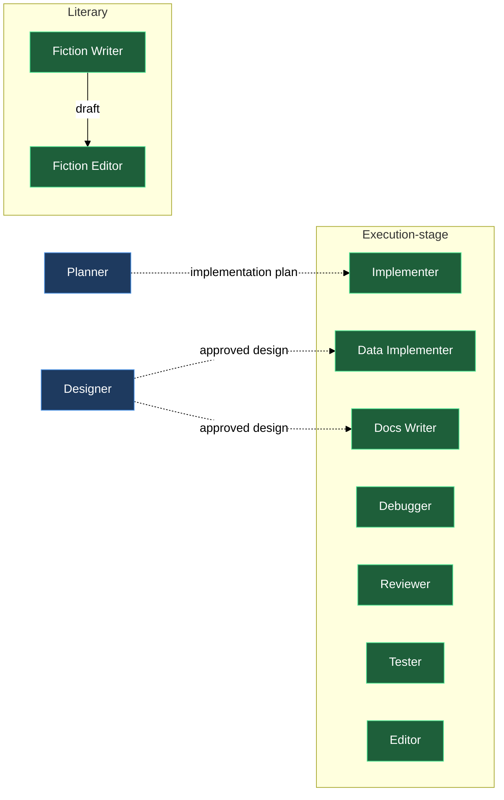

# Execution-stage agents

The `agents` block's execution-stage half turns a settled plan or design into an actual deliverable — and, for two more of those deliverables, into prose that reads clean. Six agents carry an implementation plan — or, for data-only and documentation work, an approved design directly — into code, data files, or user-facing documentation, with test-first discipline, root-cause debugging, evidence-ranked review, and mechanism-grounded testing. A seventh, the editor, takes any already-written technical document and brings its wording up to the project's writing canon without changing what it says. Two more stand apart from that group of seven: the fiction writer is a literary specialist that produces narrative prose, dialogue, and lyrical fragments from a brief or outline, and the fiction editor takes a scene the fiction writer already drafted — or any literary text your own workflow produced — and edits its prose the same way the editor does, without touching what happens in it. All nine are persona-only: each agent knows who it is and what its output must look like, but it waits for a dispatching routine to hand it a protocol before doing any work. The protocol is the only source of truth for what the agent reads as input and what it writes as output. Their upstream counterparts — the agents that produce the brief, design, architecture doc, and plan the other seven consume — are covered in the sibling `design-time-agents` chapter; the two editors work downstream of this chapter's own agents instead, correcting what they already wrote.

## What's in this block

**lazy-experts.implementer** — The implementer reads an ordered implementation plan and carries it out one task at a time, test-first. Code is a side-effect of its work; the dialogue about that work — progress, blockers, questions it cannot resolve from the plan — lives in the working journal it is dispatched against. The test-first iron law is non-negotiable: no production code without a failing test first, and a bug fix starts from a test that reproduces the bug before any code changes. It completes the full red-green-refactor cycle and commits before moving to the next task, and verifies each task with the repository's own check runner, the tests of the scope it touched, and (when the repo ships one) the guideline-review agent — never with ad-hoc checks of its own. When a task is ambiguous or depends on something absent, it surfaces the open point in the journal and stops rather than guessing forward. The plan is a read-only input; the implementer never edits it.

**lazy-experts.data-implementer** — The data implementer takes an approved design of one entity — a race, a skill, an item, a rule table — and writes it directly into the product's own data files, in the schemas the project already uses. There is no plan document between the design and the work: the design is the specification. It reads the design whole before touching a file and looks at existing entities of the same kind before inventing a shape for its own, so field order, naming, and how optional values are spelled all match what the project already does. Where the schema cannot express what the design asks for, or the design leaves a value genuinely unsettled, it records the conflict as a decision candidate in its report and leaves the field out rather than inventing a number nobody decided. Every file it writes is checked against the repository's own validators before it calls the work finished. Pick it over the implementer when there's no plan to follow because the design itself is the specification, and over the tester when the job is producing data rather than validating it.

**lazy-experts.docs-writer** — The docs writer takes the approved design of one asset and writes what it delivers into the product's own user-facing documentation — in whatever place, format, and voice that documentation already lives. There is no plan document between the design and the work: the design is the specification. It reads the design whole before writing the first line, and reads the documentation that already exists before adding to it, since the product's own docs are the most reliable statement of where a topic belongs, how deep a page goes, and how the established voice sounds. The product's documentation conventions are the law — when the design asks for something the docs' shape cannot express, it records the conflict in its report rather than bending the docs into an approximation. Where the design leaves user-visible behavior genuinely unsettled, it leaves that passage unwritten and records the gap as a decision candidate rather than inventing a claim nobody made. It runs whatever check the project provides for its documentation — a linter, a link checker, a site build — before calling the work finished, and says so when no such check exists. Pick it over the implementer when the deliverable is documentation rather than code, and over the fiction writer when the text is user-facing product documentation rather than literary prose.

**lazy-experts.debugger** — The debugger investigates a bug to its root cause before changing anything. The fix is the last step, not the first. Investigation moves through four phases: read the error exactly and reproduce it consistently; compare a working example against the broken path, listing every difference; state one hypothesis at a time and test it minimally; then write a failing test that captures the bug, make one change, and verify. "While I'm here" edits bundled with the fix are forbidden. When a series of fix attempts do not converge, the debugger surfaces the architecture itself as the open point in the journal rather than trying yet another patch. It never pretends to understand something it does not.

**lazy-experts.reviewer** — The reviewer takes a change — a diff, a finished task, a feature branch — and returns ranked findings with evidence into the working journal. Every finding names the location (path and line), the cause, and the severity: critical (breaks correctness or safety), important (should be fixed before proceeding), minor (cleanup, defer). Before asserting a finding the reviewer verifies it against the actual codebase — a plausible-but-unchecked finding wastes the operator's time. The reviewer prefers small, frequent reviews over waiting for a large change to accumulate. It does not implement fixes; it describes the problem precisely enough that the fix is obvious and leaves the implementing to the implementer.

**lazy-experts.tester** — The tester establishes what actually works, what actually breaks, and exactly how to make it break again — for a change, a feature, or a suspicion. It never invents a testing setup: before writing or running anything, it surveys the mechanisms the repository actually ships — runners and their configs, test directories and fixtures, harnesses, Makefile / CI targets, project test skills — and builds only on what it verified exists. A test plan step naming an unconfirmed mechanism is, by its own standard, a defect. Every test in the plan names the risk it covers, the discovered mechanism that exercises it, and one of the named types — smoke, functional, regression, integration, or performance — so a reader can tell at a glance what kind of confidence it buys. It executes plans literally, one step at a time, recording the actual result against the expected one — a step it could not run is recorded as blocked, never silently skipped or imagined green. Its bug reports carry environment, exact action, expected versus actual, and the verbatim decisive output. From any failure it drives toward the shortest deterministic reproduction, removing one variable at a time; a flaky repro is reported as flaky, with the observed rate, never rounded up to deterministic. It finds and documents defects; it never fixes them, edits existing tests, or makes "while I'm here" cleanups — the fix belongs to the implementer, the root cause to the debugger.

**lazy-experts.editor** — The editor takes a document someone else has already written — a design, a plan, a piece of documentation, any technical prose — and brings its wording up to the project's writing canon: shop talk, coined terminology, synonym rotation, filler, evaluative epithets, broken language. It changes how the document reads, never what it says — a claim added, dropped, narrowed, or widened while "just fixing the prose" is a defect even when the sentence reads better afterward. It reads the whole document before the first edit, since a section further down often settles how an earlier one should be worded, and checks a term against the repository's terms dictionary before deciding it's wrong — most terminology defects are a name that drifted from its source, not bad style. Every correction lands under the edit markers the protocol delivers, so the author sees exactly what changed and can reject it; a silent rewrite is a defect even when the fix was right. A sentence it cannot correct without guessing at the author's meaning is written up in the report instead, left standing unfixed. Pick it over the reviewer when defects are to be corrected in place rather than reported, and never dispatch it for literary text — that is the fiction editor's job.

**lazy-experts.fiction-writer** — The fiction writer takes a brief or story outline and produces the actual prose: narrative text, dialogue, lyrical fragments. It owns the craft of the sentence and the scene — deliberate point-of-view and psychic distance, showing state through action and sense detail rather than naming an emotion, dialogue that works on two levels at once, sentence rhythm that varies with the moment. It writes against the default failure modes of machine prose: sentiment that skews warm regardless of context, grief that resolves within its own paragraph, endings that summarize the emotional meaning the reader just felt instead of landing on action or image. It stays out of story architecture entirely — what happens, to whom, in what order — treating that as an upstream decision; when the brief or outline is missing or contradictory, it raises a question against the document rather than inventing plot. Dispatch it for fiction deliverables only, never for technical documents.

**lazy-experts.fiction-editor** — The fiction editor takes literary text someone else has drafted — usually the fiction writer's own scene — and edits its prose: rhythm, filter words, dead metaphor, named emotion where behaviour belongs, point-of-view leaks, and the tics machine prose falls into (sentiment warming a scene that isn't warm, grief resolving inside its own paragraph, the same physical choreography every time, the recurring metaphor clusters of weight and light-against-dark). What happens in the scene is not its business: plot, character decisions, who is present, and how the scene ends survive its pass untouched, and it never moves the camera to a different point-of-view character to fix a line. It reads the scene whole, twice, before the first edit — once for what it does to a reader, once for how it's built — since a line that reads badly alone is often carrying a rhythm the scene needs. Genre expectations come from whichever genre aspect is composed with it, not from the fiction editor itself; every correction lands under the same visible edit markers the editor uses. Pick it over the fiction writer when the text already exists and only its prose is in question, and over the editor when the text is a scene rather than a technical document.

## How they work together

The six technical agents share the implementation plan as their common read-only input but operate more flexibly than a strict pipeline. The implementer works through the plan task by task in sequence. For data-only work — an entity fully described by an approved design rather than by a plan — the data-implementer writes the data files straight from that design, skipping the planner's task breakdown entirely. For documentation work, the docs-writer works the same way — writing straight from the approved design into the product's own user-facing documentation, with no plan document in between. The debugger, reviewer, and tester can be dispatched at any point — the reviewer after any task's output, the debugger whenever a failure surfaces, the tester whenever you need mechanism-grounded verification of what actually works — rather than waiting for the full plan to be complete. A common loop: your routine dispatches the implementer (or data-implementer, or docs-writer) for a task, then dispatches the tester against its output; if the tester's bug report can't be resolved from the plan or design alone, the debugger investigates, and the reviewer checks the resulting change before it lands.

Each of the six is independently dispatchable. If you already have an approved entity design and just need it written into data files, dispatch the data-implementer directly. If you already have an approved design and just need the user-facing documentation written, dispatch the docs-writer directly. If you want to review an existing change without running the full pipeline, dispatch the reviewer directly. If you just need a test plan against an existing feature, dispatch the tester directly. The plan-to-code sequence is a convention, not a constraint.

The editor sits outside that six-agent loop but reads from it: dispatch it against any already-written technical document — a report, a piece of documentation, a design or plan one of the six produced — when its wording needs to meet the project's writing canon rather than another correctness pass. It corrects in place, under the edit markers the protocol delivers, so every change the editor makes is visible and rejectable; it never adds, drops, narrows, or widens what the document already decided, and a defect it cannot fix without guessing at the author's meaning goes into its report instead of getting silently guessed at. Pick it over the reviewer when the defects are to be corrected directly rather than described, and never dispatch it against literary text — that's the fiction-editor's job.

The fiction writer stands apart from that six entirely. It doesn't sit downstream of a plan or a design at all — you dispatch it directly against whatever brief or outline your own workflow produces, and it hands back prose. Because it composes with the fiction-oriented domain aspects (sci-fi, fantasy) rather than the technical ones, and because `/lazy-experts.install` seeds it with the discipline and research aspects only (no tech-writing aspect — that aspect is for dry technical prose, the opposite of what the fiction writer produces), it never appears in the same specialist entry as the six technical agents.

The fiction editor stands with the fiction writer, not with the technical group: dispatch it against a scene the fiction writer already drafted, or any literary text your own workflow produced elsewhere, and it returns the same scene with its prose corrected under the same visible edit markers — rhythm, filter words, a point of view that leaked, the tics machine prose falls into. What happens in the scene is not its business: plot, character decisions, who's present, and how the scene ends survive its pass untouched, and genre expectations come from whichever genre aspect is composed with it rather than from the fiction editor itself.

Five of the six technical agents — every one except the reviewer — split their output across two separate channels when the dispatching routine runs them as job-scoped work with its own branch. The deliverable itself — the code the implementer or debugger changed, the data files the data-implementer wrote, the documentation the docs-writer produced, a fixture or reproduction script the tester had to create — lands directly in the repository, committed by the agent itself on the job's own branch, naming every touched path explicitly; a wildcard pathspec or a bare commit never happens. The record of that work — the journal entry, the report, the bug findings — travels back a different way, through the job's `result/` folder, for the collector to place into the catalog. The reviewer never touches the working tree at all: it produces no deliverable beyond its findings, so everything it returns goes through `result/`, and a data-implementer or docs-writer dispatched as a reviewer on someone else's work follows the same rule — no working-tree edits, findings only through `result/`. The editor and fiction-editor follow neither channel exactly: both carry the Edit tool against the document itself but no Bash tool, so the edited document is their whole deliverable, and the report noting what they could not fix travels through `result/` the same as the reviewer's findings. A routine that expects an agent's report to land as a file beside the code it just changed is expecting the wrong channel; the two travel separately by design.

The only thing each agent requires from its dispatcher is the protocol document — the single source of truth for what it reads and what it writes. The agents themselves carry no hardwired I/O contract, which is what makes it possible to compose them with domain aspects without the agents needing to know about each other.

## Where this fits

- The implementation plan the implementer consumes comes from the planner, and the approved design the data-implementer and docs-writer consume comes from the designer — both covered in the sibling `design-time-agents` chapter. This chapter's six plan/design consumers are the downstream half of the same `agents` block; the editor and fiction-editor sit one hop further downstream still, correcting what those agents (and the fiction writer) already produced.
- Run `/lazy-core.agent-models` to adjust which model tier each agent uses. The six agents that carry a plan or design into a new deliverable — implementer, data-implementer, docs-writer, debugger, reviewer, tester — have Bash access and perform heavier work than the design-time quartet; the editor and fiction-editor don't, since their job is confined to editing an existing document in place. The fiction writer defaults to the highest tier as well, since prose quality benefits most from the strongest model. You may want to route any of these to a different tier.
- The **aspects** block composes domain knowledge (e.g. `lazy-experts.claude-plugin-aspect`, `lazy-experts.game-dev-aspect`) into the six technical plan/design consumers and the editor here, and genre knowledge (e.g. `lazy-experts.sci-fi-aspect`, `lazy-experts.fantasy-aspect`) into the fiction writer and fiction editor, via your `lazy.settings.json[experts]` entry. Aspects shape how an agent implements, debugs, reviews, tests, documents, edits, or writes — they do not change which agent runs or what protocol it follows.
- The **composition** block shows how to wire a concrete specialist — pairing one agent with one or more aspects — in `lazy.settings.json[experts]`.
- The dispatching routine is not part of this plugin. You bring your own routine (consumer-side), or a future `lazycortex-specs` integration dispatches these agents as part of a spec workflow.

## The execution-stage lineup

