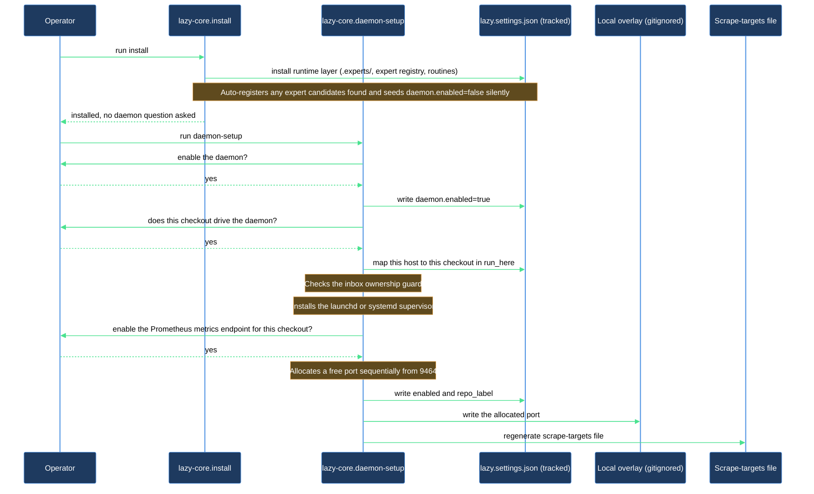
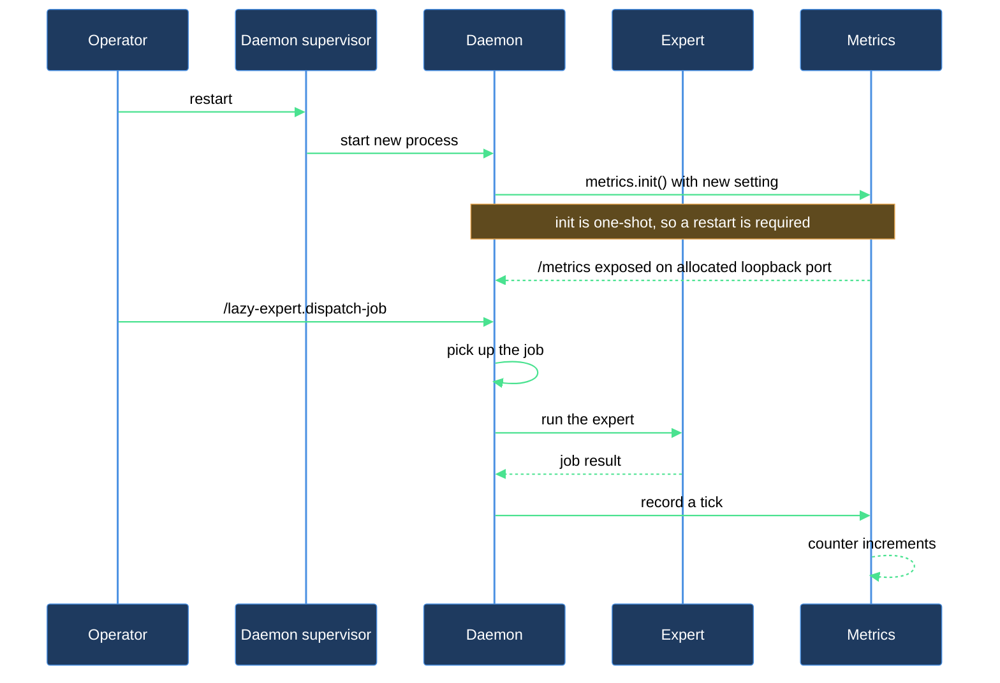
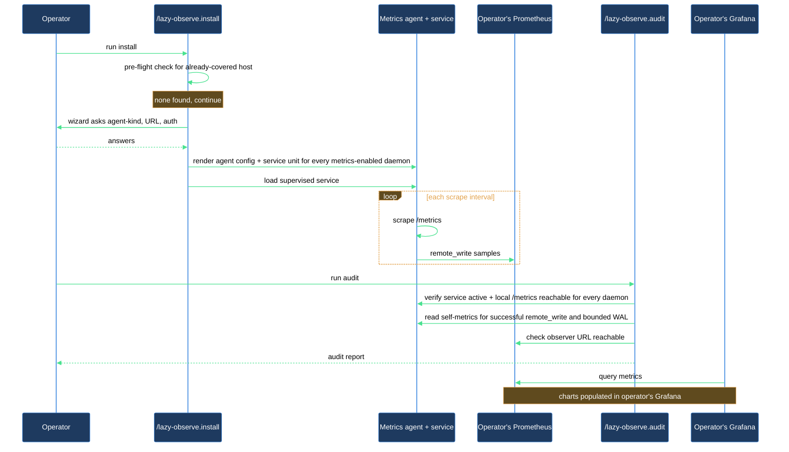

# Ship your first runtime metric to a self-hosted Prometheus stack

You have a fresh checkout. You want runtime metrics from this repo flowing into your own Prometheus or Grafana stack so you can chart routine throughput, error rates, queue depth, and Anthropic token spend. This walkthrough takes you from zero to a populated dashboard, end to end.

## What you need

- **A fresh `lazycortex` repo** (or one where you haven't yet run `/lazy-core.install`). The walkthrough creates state under `.experts/` and `.claude/lazy.settings.json`.
- **A registered expert to produce traffic in Step 2.** `/lazy-core.install` registers experts automatically and asks no questions — it scans for agent files carrying `expert_protocol:` frontmatter (project `.claude/agents/`, user `~/.claude/agents/`, and the plugin cache) and registers every one it finds. On a truly fresh checkout with no custom agents, nothing is registered for you to manually dispatch traffic to — author a minimal agent file with `expert_protocol:` frontmatter before Step 1, or substitute an expert you've already registered elsewhere when you reach Step 2.
- **A Prometheus-compatible `remote_write` endpoint** you already operate — Grafana Cloud, self-hosted Prometheus, Mimir, VictoriaMetrics, anything that accepts the standard remote_write protobuf. This walkthrough does not stand up the observer side.
- **`grafana-alloy` or `otelcol-contrib`** on your `$PATH`. Install via `brew install grafana/grafana/alloy` (macOS) or your distro's package (Linux). The install skill prints the right command if missing.
- **A bearer token or basic-auth credential** for your observer's `remote_write` endpoint, ready to paste into the install wizard.

## The journey

### Step 1 — Install lazycortex-core, then enable the daemon and metrics

Run `/lazy-core.install` first. It installs the runtime layer whole — `.experts/`, the expert registry, every built-in routine — and asks nothing about a daemon: on a repo with no runtime config yet it seeds `daemon.enabled` as `false` silently. Expert registration asks no questions either: the skill silently registers every candidate it finds carrying `expert_protocol:` frontmatter, plus one built-in candidate it always adds regardless of scan results — `lazy-runtime.doctor`, the runtime doctor expert (dispatched only by its own hourly health-check tick, not something you invoke manually for traffic).

A background daemon — and the metrics endpoint it serves in-process — only come from a deliberate opt-in, and that is a separate skill. Run `/lazy-core.daemon-setup`. It stops with a pointer back to `/lazy-core.install` if the runtime layer is missing, otherwise it walks its steps in order:

1. **Daemon enabled gate.** With `daemon.enabled` at `false` it asks *"Enable a background daemon for this repo?"* Answer yes — the skill flips the flag itself.
2. **Run-here gate.** It asks *"Drive the daemon from THIS checkout on this machine?"* Answer yes — that records `daemon.run_here` as a hostname-to-checkout map pointing at this machine and this path. The named checkout must be a git-only clone outside Dropbox (for example `~/lazy-runtime/<repo>`); the daemon refuses to start under a Dropbox folder.
3. **Inbox ownership guard.** A read-only check that no other project on this host drives the same inbox directory. A collision stops the skill before any supervisor is installed; resolve it by pointing the other project's `daemon.run_here` elsewhere, then re-run.
4. **Supervisor install.** It installs the platform supervisor unit (launchd on macOS, systemd on Linux) for this checkout and starts it.
5. **Provision metrics.** Because a supervisor now runs here, the skill asks one more question: *"Enable the Prometheus `/metrics` endpoint for this checkout's daemon?"* Answer yes. It allocates a free port sequentially from `9464` (reusing this checkout's already-recorded port on any later re-run), writes `enabled` and a human-readable `repo_label` (default: the folder name) into the tracked `lazy.settings.json`, and stores the actual allocated port only in this checkout's gitignored local overlay — a port free on one machine can be taken on another, so it never travels through git. It also regenerates the host scrape-targets file. The report line for this step reads `metrics-enabled port=<port> label=<label> scrape-targets=<count>` — note the port, you need it next.

Every answer is remembered in the tracked `lazy.settings.json`, so re-running the skill never re-asks a recorded question. The skill ends by reminding you to commit that file — it carries the daemon gates to every clone.

The supervisor was loaded in step 4, before the metrics question was answered, and `metrics.init()` only runs once at process start — so restart the supervisor now to pick up the setting: `launchctl kickstart -k gui/$UID <label from the plist path the report named>` on macOS, or `systemctl --user restart <unit name from the report>` on Linux.

Verify locally: `curl -fsS http://127.0.0.1:<port>/metrics | head` should show lines starting with `lazycortex_runtime_`. If you see nothing, re-check the daemon-setup report for the metrics step's outcome and the supervisor logs.

### Step 2 — Produce some traffic

The metrics endpoint is up but every counter is zero — nothing has ticked yet. Dispatch a single job to the expert you registered before Step 1 to produce one tick:

```
/lazy-expert.dispatch-job <expert-name>
```

Where `<expert-name>` is the name of the custom expert agent that Step 1's automatic scan registered for you. The pump routine picks up the READY job within `polling_interval_sec` (default 5), runs the expert, records a `lazycortex_runtime_routine_ticks_total{routine="expert-pump",status="ok"}` increment, and writes a tokens record under `.logs/lazy-core/runtime/tokens.jsonl`.

Re-run `curl http://127.0.0.1:<port>/metrics | grep ticks_total` — the counter should now read `1` (or higher).

### Step 3 — Install the shipper

Run `/lazy-observe.install`. The skill first checks, read-only, whether metric collection is already covered on this host — an installed lazycortex-observe service, a running scraper process, or a live connection to a daemon's metrics port. On a clean host this reports clear and the wizard proceeds to the four questions below.

If a collector already covers the host, the outcome depends on which one: our own previously-installed lazycortex-observe shipper aborts the run untouched (re-run with `--force-standalone` to re-render it anyway); a foreign collector already scraping this host — an existing Prometheus, otelcol, or Alloy instance — switches the run into integrate mode automatically instead, no questions asked. In that case the wizard below is skipped entirely: the skill regenerates the Prometheus file_sd scrape-targets file and prints the one-time `file_sd_configs` snippet for you to add to your existing stack. Pass `--integrate-only` to force that mode explicitly even on a clean host, or `--force-standalone` to install the shipper despite detected coverage.

Assuming a clean host, the wizard asks four things in sequence (one `AskUserQuestion` each, in operator-driven order):

1. **Agent kind** — pick **Grafana Alloy** if your stack is Grafana-centric, **OpenTelemetry Collector** otherwise. Both emit identical Prometheus series, so the choice is reversible.
2. **`remote_write` URL** — paste your observer's endpoint (e.g. `https://prometheus-prod-XX-prod-eu-west-X.grafana.net/api/prom/push`).
3. **Auth kind** — bearer token, basic auth, or none.
4. **Token source** — write to a 0600 file at `${XDG_CONFIG_HOME:-~/.config}/lazycortex/observe.token` OR source from the `LAZYCORTEX_OBSERVE_TOKEN` env var. File is the default; env is for containers / secret-manager-injected setups.

After answering, the skill renders the agent config covering every metrics-enabled daemon on this host — if you later run several checkouts on the same machine, one shipper instance ships all of them, no re-install needed — plus the platform-appropriate service unit (launchd plist on macOS, systemd user unit on Linux), loads it via `launchctl bootstrap` / `systemctl --user enable --now`, and runs a smoke test. If everything passes you'll see `up` in the report.

Right after the smoke test, install also looks for a Grafana provisioning directory on this host — an entry already recorded in your answer file, the config of a running `grafana server` process, or one of the packaged `grafana.ini` locations — and copies the shipped `lazycortex-runtime.json` dashboard straight into it, so the dashboard shows up in Grafana with no manual import. Grafana's own file provider reloads that directory on its own interval, so nothing else needs restarting. On a host with no local Grafana, or one whose provisioning tree the probe can't find, this step reports `skipped-no-grafana` and changes nothing — you can still import the dashboard by hand (see After you're done), or record the directory yourself as `grafana_dashboards_dir` in `${XDG_CONFIG_HOME:-~/.config}/lazycortex/observe.toml` and re-run install to pick it up.

### Step 4 — Verify end to end

Run `/lazy-observe.audit`. The skill runs through 8 ordered steps — reading its answer file, then six read-only checks (service unit loaded, agent process up, local `/metrics` reachable for every daemon on this host, agent's self-metrics show successful `remote_write`, observer URL reachable, WAL directory bounds), then rendering the report — and reports each check as `PASS` / `INFO` / `WARN` / `FAIL` with a one-line fix on any non-`PASS` result.

Expected output: all `PASS`, with `Step 5 — Agent self-metrics show successful remote_write` at `rate=N/min` (N > 0). If `Step 5` is `WARN zero-rate` your agent is up but not delivering — the audit will name the likely cause (token expired / observer unreachable / WAL recovering). `Step 7 — WAL directory bounds` may report `INFO empty` instead of `PASS` on a fresh install — nothing has accumulated in the WAL yet, and there's nothing to act on.

## After you're done

If Step 3 auto-provisioned the dashboard (a local Grafana provisioning directory was found), it's already showing up in your Grafana — nothing else to do. Otherwise, open your observer's UI (Grafana, Mimir Explore, etc.) and query `lazycortex_runtime_routine_ticks_total` — at least one series should show data — then import `plugins/claude/lazycortex-observe/dashboards/lazycortex-runtime.json` into Grafana by hand for the shipped list-centric dashboard: a Daemons Health table up top (one row per repo — a single Status column reading `OK` / `WORK` / `HALTED` / `PAUSED`, where `WORK` flags a dirty tree blocking dispatch over an uncommitted working tree and `PAUSED` reflects the daemon-pause semaphore, a Queue column carrying the whole repo's expert queue standing on disk right now — queued plus active jobs summed across every expert, a live snapshot rather than a period total — plus failed/dead jobs and errors with red backgrounds), a Routine health table with per-routine Ticks / Runs / Errors / Busy time / Cost columns (Runs counts only ticks that actually dispatched something, separate from the scheduler's raw tick cadence; gradient bars sit on Errors, Busy time, and Cost), an Expert health table right below it (one row per expert × repo — Jobs / Done / Failed / Dead / Deferred / Errors / Busy time / Cost over the selected period, drawn from the same attempt log the pump writes to `jobs.jsonl`, so you can see which expert is chewing through retries before it shows up as an open or problem job), a full-width Open jobs timeseries broken out by expert × repo (queued and active over the selected period, sized so the legend table under it stays readable), and a token section closing the page with a per-expert breakdown table — one row per expert × repo, Input / Output / Cache read / Cache write / Total — plus expert/model/repo/kind donuts (model names drop the `claude-` prefix) — all driven by a single `period` selector instead of the time picker. Every Cost column is an estimate: tokens priced at Anthropic list rates per model family (fable/mythos $10, opus $5, sonnet-5 $2, sonnet-4 $3, haiku $1 per 1M input tokens; output 5x, cache read 0.1x, cache write 1.25x that rate); models outside those families count as $0. Add `plugins/claude/lazycortex-observe/alerts/lazycortex-runtime.rules.yml` to your Prometheus `rule_files` glob to enable the seven shipped alerts: `LazyCortexRoutineStaleNoTick` and `LazyCortexRoutineErrorRateHigh` (a routine stopped ticking, or its error rate crossed 10% over 10 minutes), `LazyCortexDaemonHalted` (critical — the daemon stopped scheduling; the alert names the reason and points you at `/lazy-runtime.recover`), `LazyCortexExpertJobsFailing` and `LazyCortexDeadLetterQueueGrowing` (a job finished without completing, or parked failed/deferred/dead bundles are waiting for triage), `LazyCortexIncidentsOpening` (the error ledger opened a new incident), and `LazyCortexNoMetricsScraped` (Prometheus stopped scraping this host).

Re-run `/lazy-observe.audit` periodically (e.g. weekly) to catch slow drift — token rotation gone wrong, WAL accumulation past the configured `max_age`, observer endpoint changes. The skill is read-only, so it's safe to run as often as you want.

To tear down: `/lazy-observe.uninstall` unloads the service and removes the rendered configs. Operator-private state under `${XDG_CONFIG_HOME:-~/.config}/lazycortex/` is preserved by default — re-installing later picks up the same answers without re-prompting.

## How it flows

### Install and enable metrics



This phase shows how the two core skills install the runtime layer, enable the daemon, and turn on its metrics endpoint on an allocated port.

### Produce a metrics tick



This phase shows how restarting the supervisor exposes `/metrics` and how one dispatched expert job increments the metrics counter.

### Ship and verify metrics



This phase shows how the shipper is installed, forwards the scraped metrics to your Prometheus, and is verified by the audit until your Grafana charts fill in.
