# Install and audit

Getting `lazycortex-obsidian` working in a project comes down to three skills that each own a distinct part of the lifecycle. `/lazy-obsidian.install` is the one-stop entry point: it syncs plugin rules and the tag-page template, installs Dataview into your vault, and chains into the iconize-sync and diagram render-glue setups so the full vault reaches a usable baseline in a single pass. `/lazy-obsidian.update-plugin` is the primitive beneath it — the workhorse that resolves, fetches, deep-merges opinionated settings, and registers any single Obsidian community plugin; you can also call it directly when you need to refresh one plugin out of band. `/lazy-obsidian.audit` is the drift check you run when the vault's config may have moved — it compares the live config against the tracked manifest, when the vault has one, and presents a grouped PASS / WARN report you can act on in-place.

All three are idempotent. Running `/lazy-obsidian.install` a second time produces no mutations if nothing changed, and `/lazy-obsidian.update-plugin` skips the binary copy when the vault is already at the latest version.

## When you'd use this

- Bootstrapping a freshly cloned repo: run `/lazy-obsidian.install` once to bring the vault to a working baseline (Dataview, Iconize, CSS snippets, diagram render glue) without any manual setup.
- Refreshing a single vault plugin after a new upstream release: run `/lazy-obsidian.update-plugin <id>` directly — no need to re-run the full install.
- Checking whether a vault whose config you snapshotted has since drifted — someone toggled a setting, added a snippet, or a plugin was quietly upgraded: `/lazy-obsidian.audit` reports it automatically whenever the repo carries a tracked `.obsidian.manifest.json`.
- Re-running install safely after a plugin update: `/plugin update lazycortex-obsidian@lazycortex` refreshes the plugin cache but does not re-sync rule or template files — follow it with `/lazy-obsidian.install` to pick up changes.

## How it fits together

You start with `/lazy-obsidian.install`. It detects whether you are installing at project scope (the common case) or user scope, then works through the rule-template sync, the tag-page template, and the Dataview install in order. For the Dataview install it calls `/lazy-obsidian.update-plugin dataview` — that primitive fetches the latest release from GitHub, deep-merges the opinionated `dataview` override block from `plugin-settings.json` onto the vault's `data.json`, and registers the id in `community-plugins.json`. Next it chains into `/lazy-obsidian.iconize-install` automatically (no opt-in) — that chain calls `/lazy-obsidian.update-plugin` again for its own dependencies (Iconize, Folder Notes, the bundled `iconize-reloader`). It then syncs and enables every CSS snippet the plugin ships — the mermaid and ASCII diagram-fit snippets plus `callouts.css` (styling for the `[!decision]` / `[!decision-candidate]` callout types) — into your vault's `snippets/` folder, appending each one to `appearance.json`'s `enabledCssSnippets` array; this is the plugin's single writer of that array, so the diagram-install chain that follows (also automatic, no opt-in) only declares its own snippet files rather than touching the array itself. If a later plugin update drops a snippet the vault still has enabled, this same step also removes its now-dead `enabledCssSnippets` entry, so the array never points at a file that no longer exists. Finally, at project or user scope, it seeds the agent-model tier for the plugin's `lazy-obsidian.gen-tag-pages` subagent into `lazy.settings.json` — non-destructively, so a tier you've already customized locally is left alone. At the end you get a single structured report covering every step.

`/lazy-obsidian.update-plugin` is intentionally narrow: one plugin id per call, no side effects on sibling dirs, backup-safe (`manifest.json.bak` / `main.js.bak` are created before any download, restored on failure). When you pass `--bundled`, the skill copies binaries from the plugin's own templates instead of hitting GitHub — useful for `iconize-reloader`, which ships inside this plugin, and safe in offline environments. The state tuple it prints (`binary=... overrides=... community=...`) is machine-readable so the calling skill can log it verbatim.

`/lazy-obsidian.audit` runs independently of install — invoke it any time you want a drift check. When the repo carries a tracked `.obsidian.manifest.json`, it compares the live vault config against that manifest; without one it reports `INFO no-manifest` and stops — nothing to compare yet. The audit is read-only end to end: every finding line already names its own repair route right there, so there is no in-audit question to answer. `PASS` means the vault and its manifest agree; `INFO` covers a plugin whose installed version moved past what its settings were captured under (or a credential the manifest can never carry) — nothing to act on either way; `WARN` is a genuine disagreement between `<repo>/.obsidian/` and the manifest, and only you know which side is right — `/lazy-obsidian.capture` when the vault is right (record it), `/lazy-obsidian.deploy` when the manifest is (restore it); `FAIL worker-refused` means the manifest itself doesn't parse (fixed by re-running `/lazy-obsidian.capture` to rewrite it from the live vault) or the vault has no `.obsidian/` config directory at all yet (run `/lazy-obsidian.install` first). Findings are grouped by severity with a closing summary line, `audit: <PASS|WARN|FAIL> (<n> findings)`. It is also the target of `lazy-core.doctor` Phase 3, so running the core doctor in any project that has this plugin enabled will delegate to this skill automatically.

## Common adjustments

- **Refreshing one Obsidian plugin**: run `/lazy-obsidian.update-plugin <id>`. Pass `--bundled` only for plugins that ship inside this plugin's templates (currently `iconize-reloader`).
- **Dry run before committing**: add `--dry-run` to any `/lazy-obsidian.update-plugin` call to see the state tuple (`binary`, `overrides`, `community`) that would be produced without writing anything.
- **A CSS snippet you customized conflicts with an upstream change**: `/lazy-obsidian.install` only prompts when your local edit and the shipped update touch the exact same region of a snippet — it asks you to pick **merge-shipped** (take the shipped version for that region) or **keep-local** (keep yours, still apply any non-conflicting shipped changes). Non-conflicting drift merges silently every time; you'll never be asked about it. When install runs unattended — no operator to ask, e.g. under `/lazy-core.autosetup` — it keeps your local region for that conflicting snippet automatically and still applies the rest of the shipped delta, rather than stalling on a question nobody can answer.
- **Agent model routing**: `/lazy-obsidian.install` seeds the `lazy-obsidian.gen-tag-pages` subagent's tier automatically on every run, without overwriting a tier you've already customized. If you want to adjust which tier handles `lazy-obsidian` subagents yourself, run `/lazy-core.agent-models --scope=project` — it reads the canonical defaults from `lazycortex-core` and lets you override per-agent without hand-editing `lazy.settings.json`.
- **After a plugin update**: re-run `/lazy-obsidian.install` after every `/plugin update lazycortex-obsidian@lazycortex`. The cache refresh does not propagate rule, template, or CSS snippet changes into your repo; the install skill does.
- **Vault manifest drift reported by `/lazy-obsidian.audit`**: this only appears once you've captured a baseline. If you haven't, the audit reports `INFO no-manifest` and stops — nothing to fix. Once a manifest exists, every disagreement is reported with its repair route already on the finding line — the audit itself never asks you to pick; you choose whichever side reflects intent: `/lazy-obsidian.capture` to record the vault's current state, or `/lazy-obsidian.deploy` to restore the vault from the manifest.

## How the three skills compose

```mermaid
%%{init: {'themeVariables':{'background':'transparent','lineColor':'#000','textColor':'#000','edgeLabelBackground':'#fff'},'themeCSS':'.edgeLabel{background-color:transparent!important}.edgeLabel p{background-color:transparent!important}','flowchart':{'diagramPadding':5,'useMaxWidth':true}}}%%
flowchart LR
  operatorRunsInstall["Operator runs /lazy-obsidian.install"]
  installSyncsRulesAndTemplate["Sync plugin rules and tag-page template"]
  installCallsUpdatePluginDataview["Call /lazy-obsidian.update-plugin for Dataview"]
  installChainsIconizeInstall["Chain into /lazy-obsidian.iconize-install (unconditional)"]
  iconizeCallsUpdatePlugin["Call /lazy-obsidian.update-plugin for obsidian-icon-folder, folder-notes, iconize-reloader --bundled"]
  installSyncsCssSnippets["Sync and enable CSS snippets diagram-fit and callouts in appearance.json"]
  installChainsDiagramInstall["Chain into /lazy-obsidian.diagram-install (mermaid-popup)"]
  installFinishesIdempotent["Install complete - idempotent, safe to re-run"]
  operatorRunsAudit["Operator runs /lazy-obsidian.audit"]
  auditComparesManifest{"Compare .obsidian.manifest.json against live .obsidian/ - drift found?"}
  auditWritesRunLog["Write run log only - no prompts, no other writes"]

  operatorRunsInstall -->|bootstrap| installSyncsRulesAndTemplate
  installSyncsRulesAndTemplate -->|sync| installCallsUpdatePluginDataview
  installCallsUpdatePluginDataview -->|install Dataview| installChainsIconizeInstall
  installChainsIconizeInstall -->|chain, no opt-in prompt| iconizeCallsUpdatePlugin
  iconizeCallsUpdatePlugin -->|install community plugins| installSyncsCssSnippets
  installSyncsCssSnippets -->|enable snippets| installChainsDiagramInstall
  installChainsDiagramInstall -->|install mermaid-popup| installFinishesIdempotent
  installFinishesIdempotent -->|re-run| operatorRunsInstall
  operatorRunsAudit -->|read-only scan| auditComparesManifest
  auditComparesManifest -->|yes, finding names capture or deploy route| auditWritesRunLog
  auditComparesManifest -->|no drift| auditWritesRunLog

  classDef entry fill:#1e3a5f,stroke:#4a90e2,color:#fff
  classDef guard fill:#5f4a1e,stroke:#e2a14a,color:#fff
  classDef action fill:#1e5f3a,stroke:#4ae290,color:#fff
  classDef success fill:#0d4d2a,stroke:#4ae290,color:#fff,stroke-width:2px

  class operatorRunsInstall entry
  class installSyncsRulesAndTemplate action
  class installCallsUpdatePluginDataview action
  class installChainsIconizeInstall action
  class iconizeCallsUpdatePlugin action
  class installSyncsCssSnippets action
  class installChainsDiagramInstall action
  class installFinishesIdempotent success
  class operatorRunsAudit entry
  class auditComparesManifest guard
  class auditWritesRunLog success
```

<!-- /lazy-diagram.draw lands the fence here; do not author a code block manually. -->

## See also

- [iconize](iconize.md) — the iconize-sync block (configure and apply vault icon mappings)
- [walkthroughs/vault-bootstrap](walkthroughs/vault-bootstrap.md) — end-to-end walkthrough using this block as its first step
