# Gates — driving asset readiness from design to release

Every spec asset tracks its progress at two levels that reinforce each other. Individual authored docs (`use-cases.md`, `design.md`, `architecture.md`, `ui-design.md`, `code-plan.md`, `test-plan.md`, `bug.md`, `tech.md`) carry a `spec_stage` — the per-file readiness signal. The asset's status folder-note carries five gate booleans (`spec_design_done` through `spec_released`) — the overall progression ladder. This block's three members work together across both levels: `/lazy-spec.set-stage` is the sole writer of per-file stages, and `/lazy-spec.flip-gate` is the sole writer of gate booleans. `lazy-spec.gate-tick` decides neither; it is a background poller that only clears a finished expert job's marker and structurally checks the folder-note. Rebasing branch pins and proposing the release gate after a merge moved to the `code-sync` block — see "See also" below.

When docs get approved in the review loop, the gates still advance without you having to flip anything by hand through S2 (design done, plan done) — but the decision now belongs to `spec.coordinator`, the LLM persona woken directly by the doc's own approval commit (as well as by a commit that changes the asset's folder-note). It reads the same readiness rules this block describes, then calls `/lazy-spec.flip-gate` itself. The remaining three gates — develop done, tests passing, released — need an external signal (a deploy, a green test suite, a branch merge) the coordinator cannot derive, so it narrates the asset's status in the folder-note's `# Status brief` instead of flipping blind. You never modify gate frontmatter by hand — you flip it yourself via `/lazy-spec.flip-gate`, or let the coordinator flip it once it has the signal.

**Where the coordinator actually runs.** The daemon that dispatches `spec.coordinator` runs in its own checkout — commonly a separate clone from the one you edit in Obsidian. Nothing you do reaches it until you commit AND push; nothing it decides reaches you until its own commit is pushed and you (or your vault's sync) pull. So "a commit wakes the coordinator" really means: you tick or edit → you commit and push → the daemon's own checkout pulls that commit in on its next iteration → the coordinator wakes, decides, and commits its own answer → the daemon pushes that commit → you pull it back. There is no faster path and no shared working tree.

## When you'd use this

- Marking a spec doc as in-progress, under review, or accepted as you author it.
- Checking why a gate has not advanced and manually flipping it once the prerequisite is met.
- Understanding what the background worker has already done — which stages it promoted, which gates it flipped, which callouts it dropped — after returning from a review session.
- Regressing a gate when a deploy is rolled back or a test suite breaks (`/lazy-spec.flip-gate --off`).
- Cancelling an optional doc (`tech.md`, `code-plan.md`, `test-plan.md`, `use-cases.md`, or `ui-design.md`) when a feature needs no code, a bug needs no formal fix plan, an asset needs no dedicated functional test plan, or its behavior/interface is settled enough to skip a dedicated requirements or screens pass.
- Understanding why an already-approved document reverted to `draft` and its gate turned back off on its own — an upstream source document was re-approved after it (source staleness), not an operator or reviewer action.

## How it fits together

You reach for `/lazy-spec.set-stage` whenever you want to record a conscious authoring decision on a single doc: moving it from `empty` to `draft` when you start writing, or from `draft` to `approved` manually before the review machinery has run. You pass it one file path and one stage value from the closed set `empty | draft | approved | rejected | cancelled | deferred`; the skill rewrites `spec_stage` in frontmatter, keeps the `spec/<stage>` Obsidian tag in sync, and on `approved` stamps `spec_approved_at` (an ISO 8601 UTC datetime) on the doc itself; nothing is written to the folder-note. You never need to touch `spec_stage` or the mirror tag directly — the skill does both in a single edit and refuses any value outside the closed set, including the removed `review`, `done`, and `wtr` stages from older plugin versions. `deferred` is the park: a document you want to keep but not work on right now. Nothing automatic acts on a parked document — an approval landing on it moves nothing, no gate closes on it, nothing edits it, and no checkbox offers to write a replacement beside it. The coordinator still notices your commit and keeps the folder note tidy around it. What you get instead is a `Review <doc>` row on the folder note; ticking it unparks the document back to `draft` and reopens its review in one move. `draft` is the only way out, whether you tick that row or run `/lazy-spec.set-stage <doc> draft` yourself. When the asset sits inside a group folder that has a container note (e.g. `bugs/bugs.md`), the same commit refreshes that note's stats summary so the bucket counts stay accurate — and because a group folder is transparent to the tally, the refresh climbs through every such shelf above it up to and including the product note, so a nested group folder's own note and the product's both stay current from one stage move. You never re-run a separate rollup step. An asset sitting straight at the product root refreshes the product's own note directly, since that note's stats region counts the product's children. Only the catalog root's own note is never refreshed from below. Approving a living doc — `use-cases.md`, `design.md`, `architecture.md`, `ui-design.md`, or `tech.md`, any type declared `stages: true` and `append_only: false` — also promotes its `[!decision]` blocks into the decisions registry via `lazy-spec.record-decision`, in the same commit; a refusal there (the asset is cancelled, halted, or released) is reported back to you rather than worked around, and `code-plan.md` / `test-plan.md` never trigger this since they aren't living docs. Before any of that runs, approving a doc whose body still carries a `[!decision-candidate]` callout — ticked or not, anywhere outside a code fence — is refused outright: fold the callout through the document's own review loop first, since deleting it by hand only hides the marker rather than resolving it.

A stage change on a system-level doc — `vision.md`, `design.md`, or `tech.md` sitting loose at a product root or at the vault's own content root, or `ui-design.md` at a product root, rather than inside an asset folder — works the same way: the stamp lands on the document itself, and the level note beside it (the note carrying `spec_role: product` or `spec_role: catalog`) is left alone. That level note is owned by the catalog-level coordinator, not by you — read it, never hand-edit it.

A markdown attachment sitting beside an owner doc — one carrying `spec_owner_doc` in its own frontmatter — never takes a stage change directly: `/lazy-spec.set-stage` refuses it as a target, because its `spec_stage` is a mirror of the owner's, not an independent value. Every stage write on the owner doc cascades the same stage and the same `spec/<stage>` tag to each of its markdown attachments, folded into that one commit — skipping only an attachment that is currently in its own review (`review_active: true`), which the review coordinator re-stamps once that review finalizes. A doc with no attachments makes the cascade a silent no-op.

`lazy-spec.gate-tick` runs in the background on every daemon tick, dispatched per matched status folder-note by the runtime — but it only does two small, mechanical things now: it checks whether the asset's currently-active expert job bundle carries a terminal marker (clearing it and raising a `job-done` wake in its place), and it runs a structural check on the folder-note's frontmatter and section roster. It opens no review of its own — a finished job's report reaches review because `spec.coordinator`, woken by that very `job-done` flag, submits it; that is the only path any freshly-written document takes into review. It no longer promotes stages, evaluates gate readiness, or drops `[!ready]` callouts — that reasoning moved to `spec.coordinator`, woken by the separate `lazy-spec.coordinator-watch` routine on a pulled commit that changes the folder-note, clears its active-job marker, or lands a review approval directly on one of the asset's own docs. The coordinator walks the same sibling-doc-approval and gate-readiness logic this block still describes, then calls `/lazy-spec.set-stage` and `/lazy-spec.flip-gate` itself, narrating what it did (and what it's waiting on) in the folder-note's `# Status brief`.

You reach for `/lazy-spec.flip-gate` yourself when you need to advance or regress a gate explicitly — the most common case being the three human-signal gates: after a deploy, after tests go green, after a branch merges, you run `/lazy-spec.flip-gate <asset> spec_develop_done` (or the relevant gate). The primitive itself no longer checks readiness before flipping — it performs the mutation unconditionally, refusing only when the asset is cancelled — so satisfying the gate's actual precondition (design approved, code-plan approved-or-absent, and so on) is on you when you call it directly; the skill's confirmation question is your own chance to double check before it commits. The skill asks that one confirmation question unless you pass `--auto`; pass `--off` to regress a gate, which is likewise unconditional except for the cancelled-asset guard. A confirmed flip stamps `spec_<gate>_at` — an ISO 8601 UTC datetime — onto the folder-note itself, and `--off` drops that stamp again rather than leaving a stale one; neither direction writes a `# History` line.

**The one automatic downward move: source staleness.** Every dependent document is defined against a single upstream source — the asset's `design.md` reads from its own `vision.md` when one exists, `architecture.md` / `ui-design.md` / `test-plan.md` read from `design.md`, `code-plan.md` reads from `architecture.md` when it exists or `design.md` otherwise, and a tool's report reads from its plan or, absent a plan, from `design.md`. When that source gets re-approved after the dependent already reached `approved`, `spec.coordinator` moves the dependent back to `draft` through the very same `/lazy-spec.set-stage` primitive you'd call by hand, and flips the gate the dependent's approval had closed back off through the very same `/lazy-spec.flip-gate` primitive — the single case in the whole system where `approved` is not the end of the line. Nothing about the move is silent: `# Status brief` names the dependent and the source that went stale and says what's waiting on a fresh review, and the dependent's own `Review <doc>` row reappears on the folder note for you to walk again. A document with no declared source — `bug.md`, which follows no vision — never goes stale by this rule, and the dependent's body itself is never touched; only its stage and its gate change — `# History` says nothing about it, since stage and gate moves are not journaled there.

The old fully-automatic tick-driven chain from a freshly approved `design.md` to S2 (plan done) no longer exists as a fixed cycle count — it now runs as a `spec.coordinator` wake per pushed-and-pulled commit to the asset (its folder-note, or a sibling doc's own approval): one wake promotes `design.md`'s stage, a further wake (or the same one, depending on what else changed) evaluates and flips `spec_design_done`, reconciles the ladder, and so on. Every mutation is still a separate atomic commit, and each one has to complete its own push-then-pull round trip before it is visible to whichever side reacts to it next — what changed is that an LLM decision, and a network hop, sit between each commit instead of a fixed two-tick cadence.

## Common adjustments

- **Stage a doc before submitting it for review.** Run `/lazy-spec.set-stage <path/to/design.md> draft`. The skill accepts any authored doc whose `spec_role` is `use-cases`, `design`, `architecture`, `ui-design`, `tech`, `code-plan`, `test-plan`, or `bug`.
- **Cancel an optional doc.** Run `/lazy-spec.set-stage <path/to/code-plan.md> cancelled` when the feature needs no code. The skill refuses `cancelled` on `design.md`, `bug.md`, and `architecture.md` (mandatory docs — `architecture.md` becomes mandatory the moment the coordinator judges the asset code-bearing) — use it only on `tech.md`, `code-plan.md`, `test-plan.md`, `use-cases.md`, or `ui-design.md`. The last two are opt-in requirements-scenario and interface documents available on a feature or change asset (never on a bug); like `code-plan.md` / `test-plan.md`, they don't exist until authored and can be cancelled outright when the asset needs no dedicated pass. The same mandatory rule protects a product's or the project's own `design.md` (typed `system-design`) as a mandatory doc; its paired `tech.md` (typed `system-tech`) stays cancellable exactly like an asset's `tech.md`, and so does a product's own `ui-design.md` (typed `system-ui-design`) — the product's shared look is opt-in too, present only when the operator wants one, and it never exists at the content-root or on a product's paired asset docs.
- **Approve a doc that still carries an open decision-candidate.** `/lazy-spec.set-stage <path> approved` refuses when the body has a `[!decision-candidate]` callout — ticked or not — anywhere outside a code fence. Resolve it through the document's own review loop first, then re-run the approval; a hand deletion of the callout doesn't satisfy the check.
- **Flip a human-signal gate.** Run `/lazy-spec.flip-gate <asset-dir-or-slug> spec_develop_done` after the work is deployed. For assets where the deploy is rolled back, run `/lazy-spec.flip-gate <asset> spec_develop_done --off`.
- **Skip the confirmation prompt.** Pass `--auto` to `/lazy-spec.flip-gate` when scripting or orchestrating from another skill. Without `--auto` the skill asks one wizard question before acting.
- **Check what the coordinator last did on an asset.** Read the asset folder-note's `# Status brief` (its own rewritten-every-invocation narration) for its reasoning, and its frontmatter `spec_<gate>_at` stamps plus each doc's own `spec_approved_at` for exactly when a gate or stage last moved — `# History` records other coordinator actions (command completions and the like), but neither `/lazy-spec.set-stage` nor `/lazy-spec.flip-gate` write a line there. The daemon log records each `gate-tick` and `coordinator-watch` dispatch, and `lazy-spec.flip-gate` writes its own log under `.logs/claude/lazy-spec.flip-gate/` for every flip.
- **Re-open a rejected doc.** Run `/lazy-spec.set-stage <path/to/design.md> draft` — `rejected` is not terminal; moving back to `draft` re-opens the review loop.
- **Advance a doc that has markdown attachments beside it.** Run `/lazy-spec.set-stage` on the owner doc as usual — the cascade re-stamps every attachment's `spec_stage` and `spec/<stage>` tag in the same commit. Do not target the attachment itself; the skill refuses it and points you back at the owner.
- **Check why a stage or gate regressed on its own.** Read the folder-note's `# Status brief` — a sentence naming a dependent whose source was re-approved is source staleness, not an operator action or a bug (compare the source's `spec_approved_at` with the dependent's to see the order yourself). Reconcile the dependent against its freshly re-approved source, then send it back through the review loop as usual (`/lazy-spec.set-stage <dependent> draft` already ran for you; you only need to bring the content current and resubmit).

## How the layers feed each other

Per-file `spec_stage` moves `empty → draft → approved` via `lazy-spec.set-stage`, and once `design.md` (or `code-plan.md`, when authored) reaches `approved`, `spec.coordinator` — not `lazy-spec.gate-tick` — auto-flips `spec_design_done` and `spec_plan_done`. From there the three human-signal gates (`spec_develop_done`, `spec_tests_passing`, `spec_released`) advance in a chain, each flipped via `/lazy-spec.flip-gate` on an external signal.

```mermaid
%%{init: {'themeVariables':{'background':'transparent','lineColor':'#000','textColor':'#000','edgeLabelBackground':'#fff'},'themeCSS':'.edgeLabel{background-color:transparent!important}.edgeLabel p{background-color:transparent!important}','flowchart':{'diagramPadding':5,'useMaxWidth':true}}}%%
flowchart LR
  setStagePerFile["lazy-spec.set-stage moves file stage"]
  stageReachesApproved{"design.md or code-plan.md approved?"}
  autoFlipDesignPlanGates["spec.coordinator auto-flips spec_design_done + spec_plan_done"]
  flipDevelopDone["/lazy-spec.flip-gate sets spec_develop_done"]
  flipTestsPassing["/lazy-spec.flip-gate sets spec_tests_passing"]
  flipReleased["/lazy-spec.flip-gate sets spec_released"]

  setStagePerFile -->|empty to draft to approved| stageReachesApproved
  stageReachesApproved -->|not yet| setStagePerFile
  stageReachesApproved -->|yes| autoFlipDesignPlanGates
  autoFlipDesignPlanGates -->|external signal| flipDevelopDone
  flipDevelopDone -->|external signal| flipTestsPassing
  flipTestsPassing -->|external signal| flipReleased

  classDef entry fill:#1e3a5f,stroke:#4a90e2,color:#fff
  classDef guard fill:#5f4a1e,stroke:#e2a14a,color:#fff
  classDef action fill:#1e5f3a,stroke:#4ae290,color:#fff
  classDef success fill:#0d4d2a,stroke:#4ae290,color:#fff,stroke-width:2px

  class setStagePerFile entry
  class stageReachesApproved guard
  class autoFlipDesignPlanGates action
  class flipDevelopDone action
  class flipTestsPassing action
  class flipReleased success
```

The diagram above traces only the forward climb. As the source-staleness paragraph above describes, a dependent document's stage and the gate it closed can also move backward exactly once — when its upstream source is re-approved after it — via the same two primitives running in reverse.

## See also

- `authoring` block — create the spec assets whose docs flow into these gates; also owns `lazy-spec.record-decision` and the decisions registry that `spec_stage: approved` promotes into.
- `code-sync` block — `lazy-spec.sync-with-code` drives `spec_develop_done` and `spec_tests_passing` from code state; `lazy-spec.rebase-pins` rebases branch pins and proposes `spec_released` once a branch merges — see that chapter for the full flow.
- `asset-to-release` walkthrough — full journey of a single asset from creation through all five gates.
