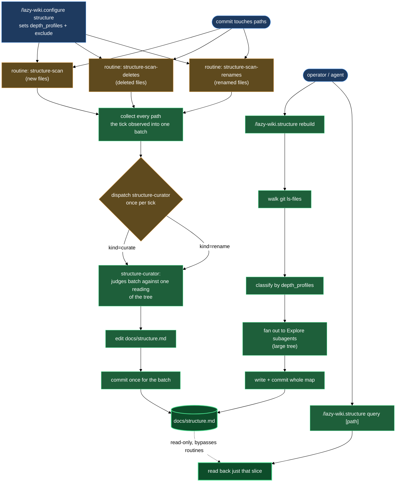

# Structure

`docs/structure.md` is one file that answers "what lives where, and where does new work go" for the whole repository — written compactly enough for an agent to read before deciding where to place a file or search for one. This block is everything that creates, updates, and answers questions against that map: the skill that builds and queries it, the curator that keeps it current automatically, and the configuration wizard that sets both up.

## What's in this block

**`lazy-wiki.structure`** is the entry point for both directions of the map. `/lazy-wiki.structure rebuild` walks the tracked tree (`git ls-files`), classifies each directory against your configured `depth_profiles`, and rewrites `docs/structure.md` from scratch — the tool for a map that drifted before the routines existed, or a hand edit that bypassed them. On a tree with more than roughly 12 top-level tracked directories, rebuild fans the work out to one `Explore` subagent per directory (batches of at most 4 concurrent), so no single context has to hold the whole tree. Before writing, rebuild resolves which language the map's own prose is written in — the wiki's own language setting if one is on record, else the repo's own default, else English — and every directory and file description, including the ones written by fanned-out subagents, is composed in that language; directory names, file names, and glob patterns are never translated. `/lazy-wiki.structure query [<path>]` is the read side — it returns only the matched slice of the map (top-level bullets when `<path>` is omitted, or the bullet plus its nested children for a given path), never the whole file. Any agent doing research — deciding where a new file belongs, or asking "where does X live" — should query through this skill rather than reading `docs/structure.md` directly.

**`lazy-wiki.structure-curator`** is the expert that keeps the map current one batch of changes at a time — routed to it as one dispatch per tick carrying every changed path, not one per path — so a full rebuild is rarely needed once the map exists. It runs in three modes: `curate` (a batch of paths appeared or vanished — decide whether each earns its own entry, and whether the change shifts what the shared parent directory is for), `rename` (a batch of paths moved — remove the old entries, re-enter the new ones at the class each new path resolves to, since a rename can cross depth-profile boundaries), and `report` (a read-only pass, dispatched by the structure section of `/lazy-wiki.audit`, that compares the map against the tracked tree and returns findings without writing anything). The curator never edits the files and directories it describes, and it never creates `docs/structure.md` — only `rebuild` does that, so one incremental entry never gets mistaken for the whole repository's map.

**`/lazy-wiki.configure structure`** is the wizard that wires the other two together: it collects your `depth_profiles` (which path globs get per-file entries, which get a directory-only line, which get a half-line note) and `exclude` globs, writes them into `lazy.settings.json[structure]`, and registers the three git-watch routines that dispatch the curator automatically. `docs/structure.md` itself is always force-included in `exclude`, silently — without it, the curator's own commit describing the map would wake the very routine that just fired, and the map would try to describe itself. When the map doesn't exist yet, the wizard builds it for you as its last step, so a fresh setup always leaves the repo with a working map rather than three routines watching a file that isn't there.

## How they work together

Two independent paths keep `docs/structure.md` accurate, and you rarely have to think about which one is running.

The **incremental path** is the default once the block is configured. Three routines — `lazy-wiki.structure-scan` (new files), `lazy-wiki.structure-scan-deletes` (deleted files), `lazy-wiki.structure-scan-renames` (renamed files) — watch every commit on your configured branch. Each routine runs in the runtime's default unit-of-work mode: every path one tick observed reaches the curator as a single dispatch carrying all of them — a directory move of forty files becomes one dispatch carrying forty paths, not forty separate dispatches for forty separate paths. The curator reads only the real paths in its batch (never the whole tree), judges every member against one reading of the tree, decides whether the map's description of a path — or its parent directory's — needs to change, applies the edits by anchoring on the existing entry lines, and commits once for the whole batch under your operator identity, naming only `docs/structure.md` in that commit's pathspec so the shared index carries nothing else. A batch that doesn't alter what the map says about any of its paths is a no-op: nothing written, nothing committed. This is why the map stays current without you ever running a command for it, and why a whole tick's worth of changes lands as one commit instead of one per file.

The **wholesale path** is `/lazy-wiki.structure rebuild`. The first time you configure the block, `/lazy-wiki.configure structure` runs it for you automatically once the routines are registered and no map exists yet — you never have to remember to seed the initial map yourself. Reach for `rebuild` directly afterward when a rebase or history rewrite the routines never saw needs a resync, or when you suspect drift the incremental path can't self-heal (a duplicated anchor line, for instance — the curator refuses to guess which one is authoritative and reports an error instead of picking one). Rebuild reads the whole tracked tree once and replaces the whole file; the routines then resume patching it per commit from that clean baseline.

Both paths write the same file in the same shape, so `/lazy-wiki.structure query` works identically regardless of which one produced the current state. If the daemon that runs the routines is disabled in your project, the map still works — you just rebuild it by hand whenever it drifts, since nothing is watching commits to patch it automatically.

`/lazy-wiki.configure structure` is where you land to change any of this: add a new `depth_profiles` class when a directory that used to get a one-line summary now needs per-file entries, widen `exclude` when a generated directory starts polluting the map, or re-register the routines if `/lazy-wiki.audit` reports one missing. Running it again on an already-configured project edits in place — persisted values are shown, pressing Enter keeps them. The language the map's prose is written in is not asked here — it follows the wiki's own language setting (or the repo default) via `/lazy-wiki.configure vault`, so a repo that already writes its wiki in one language keeps the structure map consistent with it automatically.

## Where this fits

The structure map is repo-wide and file-and-directory shaped — it answers "where", not "what does this concept mean" or "how do these pieces connect". That makes it a companion to, not a replacement for, the wiki's other blocks: `curation` builds a graph of per-node summaries and See-also links for research questions about a specific document or code file, and `terms` maintains a vocabulary dictionary so a concept doesn't grow a second name across documents. Reach for structure when the question is about placement or discovery; reach for curation or terms when the question is about meaning or naming.

## How the pieces fit together

