# Terms

A wiki scope can carry a terms dictionary — one markdown file where every `## <term>` heading is a concept the project has agreed a name for, and the body under it is the definition. The point is narrow but easy to lose without tooling: once a second name for the same thing spreads across a handful of documents, nobody can un-write it. This block is the three pieces that keep that from happening — a lookup a writer consults before coining a word, a curator that grows the dictionary from finished documents, and an audit that catches the drift that slips through anyway.

The three pieces never touch the same file at the same time. `lazy-wiki.terms` only reads the dictionary, mid-document, and never writes to it. `lazy-wiki.terms-curator` is the dictionary's only writer, and it writes only after a document is finished — never the document itself. The terms section of `/lazy-wiki.audit` writes nothing at all; it surfaces divergences and lets you decide, one at a time, which side is right.

## When you'd use this

- You're writing a document in a scope that has a terms dictionary configured, and you're about to name a concept — you want to know if the project already has a word for it before you pick your own.
- You want the dictionary to grow on its own as documents get written, without a separate step to remember.
- You suspect a document and the dictionary have drifted onto different words for the same thing, or that the dictionary has grown a stale or duplicate entry, and you want that confirmed and fixed.
- You're setting up a new scope and need to decide which documents feed the dictionary and where the dictionary file lives.

## How it fits together

**Lookup, at write time.** `lazy-wiki.terms` is what a writing expert (or you, mid-session) calls before naming something. It resolves which scope's dictionary covers the document being written from `.claude/lazy.settings.json[terms.scopes]`, then runs in one of two modes: look up one term's existing definition, or check a name you're about to use against the headings already taken. In the second mode it greps just the headings first, picks the candidates that plausibly name the same thing, and only then reads those candidates' definitions — the whole dictionary never enters the caller's context. If a candidate really does name your concept, you take the existing word, even when yours reads better; a second name for one thing is exactly what the dictionary exists to prevent. If none do, your word is new and the curator will pick it up later. Two of those candidate matches carry their own rule: when the candidate is the qualified name of the very concept you were about to call by its bare everyday word — `input field` where you meant `field` — you take the qualified term, since the bare word is exactly the ambiguity the qualifier exists to escape; and when the candidate is itself still a bare common word standing for a project entity, you write the qualified form in your document instead and list it in your own `## Terms` section with the dictionary's definition verbatim — the bare heading itself is never named anywhere in your document; the curator matches that verbatim definition and performs the rename from that section, since renaming the dictionary's heading is the curator's call, not something you do mid-sentence. This skill never edits the dictionary — deciding a term deserves an entry, or that its definition needs widening, is the curator's call once the document is finished, not a mid-sentence decision by whoever is writing.

**Curation, after the fact.** `lazy-wiki.terms-curator` owns the dictionary file and nothing else. When a document under a terms scope changes and the `lazy-wiki.terms-scan-<scope-id>` routine fires, the curator runs in `curate` mode. A run carries a **batch**, not one document — every document of one directory that changed in the same wave, because a directory's documents describe one subject and their terms are decided against each other rather than one at a time; a single changed document still arrives as a batch of one, and behaves identically. It reads the surviving documents of the batch as one body of text rather than one at a time — starting with each document's own `## Terms` section when it carries one, where each `**term** — definition` line names a candidate outright with the definition the document itself gives, and a line whose definition disagrees with the dictionary's is a divergence to record rather than a silent overwrite — then reading the rest of each body for any concepts those sections left out. Because the batch is judged together, a concept that two or more documents in the directory name is one candidate, not one per file. It reads the dictionary's headings, and for each concept the batch introduces decides whether it's genuinely new (**add**), already named but under-defined for this shade of meaning (**extend** — the existing heading stays, the body widens), still carrying a bare everyday heading for a concept the batch has now named in its qualified form (**rename** — the heading becomes the qualifying noun the definition already implies, the body stays otherwise the same, and a document still writing the bare word becomes a divergence for the audit to catch — a term is a name, never just an ordinary word, so a heading like "field" that really means one project's particular input field is renamed to say so), or colliding with a name that actually belongs to a neighbouring concept (**split** — a second entry lands under a different name, and both definitions are reworded to name each other, so a future audit can tell a fresh split from an unused term). It applies every decision, writes the dictionary, and commits **once for the whole batch** — sections sorted by heading, three physical lines per definition at most — forty documents in one directory produce one commit, not forty. It never edits the documents that triggered it.

**Audit, on demand.** The terms section of `/lazy-wiki.audit` is where drift that slipped past both of the above gets caught. It checks format and scope configuration itself, by reading — a dictionary file that doesn't exist, two scopes' `paths` overlapping, a missing `source_exclude` entry, definitions run past three lines, headings out of sort order. Then, for the judgment calls a program can't make, it dispatches `lazy-wiki.terms-curator` in `report` mode — no job dir this time, just the scope id, the dictionary path, the scope's `paths`, and its `source_exclude` in the prompt — and gets back `divergence` (a document and the dictionary disagree on the word for one concept — including two language forms of the same concept, and a document still writing the bare everyday word for a term the dictionary now carries under its qualified name), `missing` (a document names a project entity the dictionary doesn't carry), `duplicate` (two entries describe one concept), and `dead` (a term no document in the scope actually uses, excluding a term whose definition names a sibling — that's a fresh split, not a corpse). Report mode writes nothing. `/lazy-core.doctor` then walks you through each finding individually via `AskUserQuestion`, since which side of a divergence is "right" is your call, not a default — showing both words, the document, and the dictionary side by side before asking — and leaves alone anything under a document with `review_active: true` or inside a mirrored tree, since editing either would fight the process that owns them.

`<wiki-cli>` stands for the wiki plugin's `bin/lazycortex-wiki` file — the newest copy under `~/.claude/plugins/cache/lazycortex/lazycortex-wiki/<version>/`, or `plugins/claude/lazycortex-wiki/` in a checkout that authors the plugin. Every verb runs through the interpreter, `"${LAZYCORTEX_PYTHON:-python3}" <wiki-cli> <verb>`: the file carries no exec bit and is not on `PATH`.

**Applying a settled divergence.** The decision is yours; carrying it out on the document is not a judgment call, and `"${LAZYCORTEX_PYTHON:-python3}" <wiki-cli> terms-apply <document> --from "<the document's word>" --to "<the dictionary's term>"` does it. It replaces whole-word occurrences in prose only — the frontmatter block, every fenced code block, every inline code span, every link target, and the protected `# See also` section come through byte-for-byte — and leaves the rewrite uncommitted in your worktree. It refuses, with exit 1 and the reason on stderr, on a document carrying `review_active: true`, on one inside a scope's mirror tree, and on a replacement that contains the word it replaces (which could never settle). Running it a second time reports `noop`. It decides nothing: the direction comes from you, and the other half of a divergence — renaming or widening the dictionary's own term — stays a hand edit in the dictionary, where the curator is the only other writer.

## Common adjustments

- **No terms dictionary configured for a scope yet, or you want to change which documents feed it** — run `/lazy-wiki.configure terms`. It's the wizard for which documents the dictionary serves, where the dictionary file lives, and which documents count as term sources; the skills in this block only read that configuration, they don't write it.
- **`lazy-wiki.terms` says no scope matches your document** — the document's path isn't covered by any scope's `paths` globs in `terms.scopes`, or the `terms` section doesn't exist yet. Run `/lazy-wiki.configure terms` to add or widen a scope.
- **The dictionary file is missing** — none of these skills will create it for you; a silent recreation would hide the loss of every term it used to hold. Run `/lazy-wiki.configure terms` to point the scope at the right file, or restore it from git history yourself.
- **The dictionary isn't picking up new terms automatically** — check that the scope's `lazy-wiki.terms-scan-<scope-id>` routine is registered; `/lazy-wiki.audit` reports this as a `config` finding, and `/lazy-wiki.install` seeds any routine that's missing (absent-only, so an existing one is left alone).
- **You suspect drift but don't want to wait for the next commit** — run `/lazy-wiki.audit [<scope-id>]` directly; the terms section runs every time, alongside the rest of the wiki audit.

## How the pieces fit together

```mermaid
%%{init: {'themeVariables':{'background':'transparent','lineColor':'#000','textColor':'#000','edgeLabelBackground':'#fff'},'themeCSS':'.edgeLabel{background-color:transparent!important}.edgeLabel p{background-color:transparent!important}','flowchart':{'diagramPadding':5,'useMaxWidth':true}}}%%
flowchart LR
  writingExpertCallsTerms["Writing expert calls lazy-wiki.terms mid-document"]
  readsAndReturnsDefinitions["Reads dictionary, returns matching definitions, never writes"]
  documentCommitTriggersScan["Document commit triggers terms-scan routine"]
  dispatchCuratorCurate["Dispatches lazy-wiki.terms-curator, curate mode, with directory's batch"]
  decideConceptAction{"Add, extend, rename, or split candidate concept?"}
  editsDictionaryCommitsBatch["Edits dictionary, commits once for whole batch"]
  auditChecksFormatScope["lazy-wiki.audit terms section checks format and scope config"]
  dispatchCuratorReport["Dispatches lazy-wiki.terms-curator, report mode"]
  curatorReportsFindings["Reports divergence, missing, duplicate, dead findings"]
  doctorPresentsFindings{"lazy-core.doctor presents each finding to operator"}
  operatorAppliesChosen["Operator applies only what they choose"]
  termsDictionaryFile["Shared terms dictionary file"]

  writingExpertCallsTerms -->|queries, lookup or check mode| readsAndReturnsDefinitions
  readsAndReturnsDefinitions -->|reads| termsDictionaryFile
  documentCommitTriggersScan -->|triggers| dispatchCuratorCurate
  dispatchCuratorCurate -->|reads batch as one body plus dictionary headings, one candidate per concept| decideConceptAction
  decideConceptAction -->|add| editsDictionaryCommitsBatch
  decideConceptAction -->|extend| editsDictionaryCommitsBatch
  decideConceptAction -->|rename| editsDictionaryCommitsBatch
  decideConceptAction -->|split| editsDictionaryCommitsBatch
  editsDictionaryCommitsBatch -->|writes and commits batch| termsDictionaryFile
  auditChecksFormatScope -->|reads| termsDictionaryFile
  auditChecksFormatScope -->|dispatches| dispatchCuratorReport
  dispatchCuratorReport -->|reads for meaning checks, writes nothing| curatorReportsFindings
  curatorReportsFindings -->|surfaces| doctorPresentsFindings
  doctorPresentsFindings -->|operator accepts| operatorAppliesChosen
  doctorPresentsFindings -->|operator declines| curatorReportsFindings

  classDef entry fill:#1e3a5f,stroke:#4a90e2,color:#fff
  classDef guard fill:#5f4a1e,stroke:#e2a14a,color:#fff
  classDef action fill:#1e5f3a,stroke:#4ae290,color:#fff
  classDef success fill:#0d4d2a,stroke:#4ae290,color:#fff,stroke-width:2px

  class writingExpertCallsTerms entry
  class readsAndReturnsDefinitions success
  class documentCommitTriggersScan entry
  class dispatchCuratorCurate action
  class decideConceptAction guard
  class editsDictionaryCommitsBatch success
  class auditChecksFormatScope entry
  class dispatchCuratorReport action
  class curatorReportsFindings action
  class doctorPresentsFindings guard
  class operatorAppliesChosen success
  class termsDictionaryFile action
```

<!-- /lazy-diagram.draw lands the fence here; do not author a code block manually. -->

## See also

- [audit](audit.md) — The full `/lazy-wiki.audit` integrity sweep this block's audit half belongs to, including the checks that aren't about terminology.
- [curation](curation.md) — The sibling curator that classifies and links wiki nodes; a different expert, same one-writer-per-file discipline.
